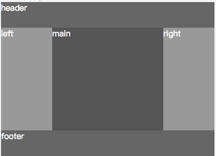
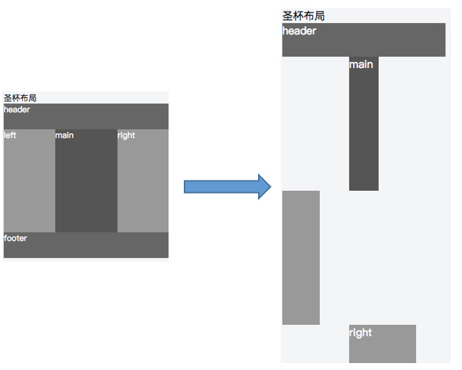
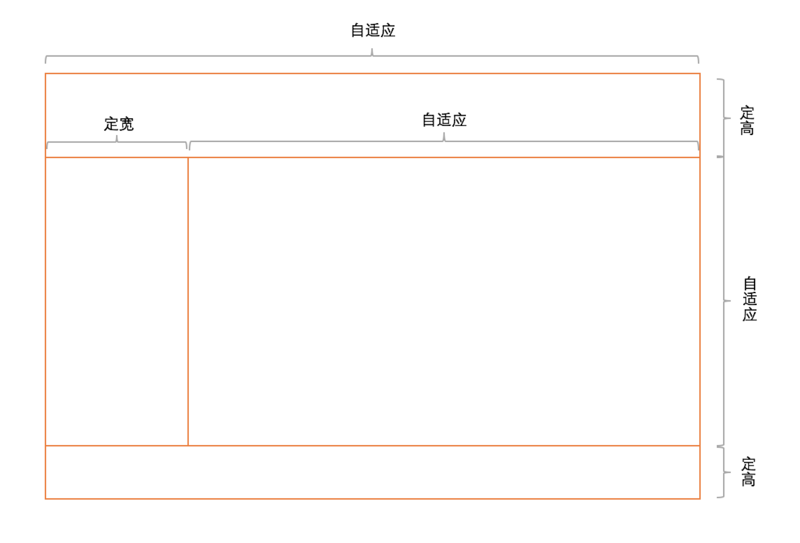
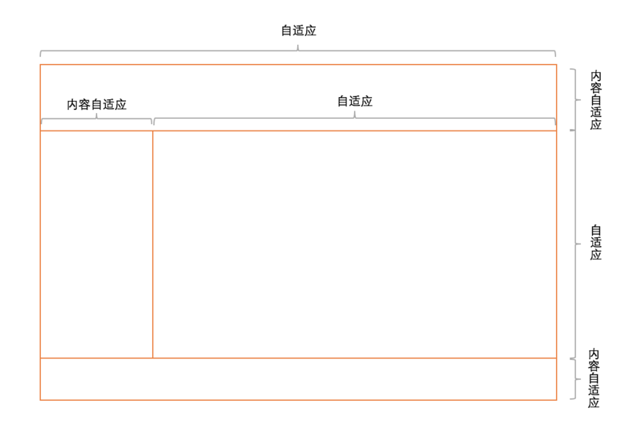

# CSS 布局

## 一、两列布局
### 情形一：左边宽度固定、右边宽度自适应
#### 方法一：左边左浮动，右边宽度100%
``` html
<div class="left">左边固定</div>
<div class="right">右边自适应</div>
```

``` css
.left {
  width: 300px;
  float: left;
  }
.right {
  width: 100%;
  margin-left: 300px;
}
```

> 注意：IE6 中会有 3 像素的 BUG，解决方法可以在 .left 加入 margin-left:-3px。

还有另一种写法，使用 overflow:hidden ：

``` css
.left {
  float: left;
  width: 300px;
  margin-right: 10px;
}
.right {
  overflow: hidden;
}
```

* 优点：简单；
* 缺点：不支持 ie6。

#### 方法二：右边宽度使用 calc
``` html
<div class="left">左边固定</div>
<div class="right">右边自适应</div>
```

``` css
.left {
  width: 300px;
  float: left;
}
.right {
  float: left;
  width: calc(100vw - 200px);
}
```
#### 方法三：使用 flex
``` html
<div class="wrap">
  <div class="left">左边固定</div>
  <div class="right">右边自适应</div>
</div>
```

``` css
.father {
  display: flex;
}
.left {
  width: 300px;
}
.right {
  flex: 1;
}
```

#### 方法四：使用 table
``` html
<div class="parent">
  <div class="left">左边固定</div>
  <div class="right">右边自适应</div>
</div>
```

``` css
.parent {
  display: table;
  table-layout: fixed;
  width: 100%;
}
.left {
  width: 100px;
}
.right,
.left {
  display: table-cell;
}
```

#### 方法五：使用 float + overflow
``` html
<div class="left">
  <p>left</p>
</div>
<div class="right">
  <p>right</p>
</div>
```

``` css
.left {
  float: left;
  width: 100px;
}
.right {
  overflow: hidden;
}
```

设置 overflow: hidden 会触发 BFC 模式（Block Formatting Context）块级格式上下文。BFC 是什么呢。用通俗的来讲就是，随便你在BFC 里面干啥，外面都不会受到影响 。此方法样式简单但不支持 IE 6。

### 情形二：左边自适应、右边固定
#### 方法一：使用 float + margin
``` html
<div class="wrap">
  <div class="left"></div>
</div>
<div class="right"></div>
```

``` css
.wrap {
  width: 100%;
  float: left;
}
.left {
  margin-right: 300px;
}
.right {
  float: left;
  width: 300px;
  margin-left: -300px;
}
```

或者：

``` css
.left {
  float: left;
  width: 100%;
  margin-right: -100px;
}
.right {
  float: right;
  width: 100px;
}
```

#### 方法二：使用 table
``` html
<div class="parent">
  <div class="left">左边自适应</div>
  <div class="right">右边固定</div>
</div>
```

``` css
.parent {
  display: table;
  table-layout: fixed;
  width: 100%;
}
.left {
  display: table-cell;
}
.right {
  display: table-cell;
  width: 100px;
}
```

#### 方法三：使用 flex
``` css
.parent {
  display: flex;
}
.left {
  flex: 1;
}
.right {
  width: 100px;
}
```

## 二、三列布局
以下是我们常见的三列布局，左右两侧宽度固定，中间宽度自适应：



### 使用 table
``` html
<div class="parent">
  <div class="left">左边固定</div>
  <div class="main">中间自适应</div>
  <div class="right">右边固定</div>
</div>
```

``` css
.parent {
  display: table;
  width: 100%;
  table-layout: fixed
}
.left,
.main,
.right {
  display: table-cell;
}
.left {
  width: 100px;
}
.right {
  width: 100px;
}
```

### 绝对定位
如果我们希望中部 main 部分优先显示的话，是可以做布局优化的。将 main 部分提前即可优先渲染。

``` html
<div class="center">center</div>
<div class="left">left</div>
<div class="right">right</div>
```

``` css
.center {
  margin: 0 100px;
}
.left, .right {
  width: 100px;
  position: absolute;
  top: 0;
}
.left { left: 0;}
.right { right: 0;}
```

绝对定位是最简单的一种三列布局方式，但是也存在一定的问题。那就是高度不可控，如果 left 部分的高度高于 center ，left 就没有能力撑起整个 wrap 。而以下「圣杯」和「双飞翼」两种方式就能解决这个问题。

### 浮动
``` html
<div class='left'>left</div>
<div class='right'>right</div>
<div class='center'>center</div>
```

``` css
.left,.right {
  width: 200px;
}
.left{
  float: left;
}
.right {
  float: right;
}
.center {
  margin: 0 210px;
  overflow: hidden;
}
```

注意：center 的 div 需要放在最后面。

### 圣杯布局
``` html
<div class="center">main</div>
<div class="left">left</div>
<div class="right">right</div>
```

``` css
.center {
  position: relative;
  float: left;
  width: 100%;
}
.left {
  position: relative;
  float: left;
  width: 100px;
  margin-left: -100%;
  left: -100px;
}
.right {
  position: relative;
  float: left;
  width: 100px;
  margin-left: -100px;
  right: -100px;
}
```

使用了 relative 相对定位、float 和 负值 margin ，将 left 和 right 部分「安装」到 wrap 的两侧，顾名「圣杯」。

圣杯布局在正常情况下是没有问题的，但是特殊情况下就会暴露此方案的弊端，如果将浏览器无线变窄，「圣杯」将会「破碎」掉。如图，当 center 部分的宽小于 left 部分时就会发生布局混乱。



于是，淘宝针对「圣杯」的缺点做了优化，并提出「双飞翼」布局。

### 淘宝双飞翼
``` html
<div class="wrap">
  <div class="center">center</div>
</div>
<div class="left">left</div>
<div class="right">right</div>
```

``` css
.wrap {
  width: 100%;
  float: left;
}
.center {
  margin: 0 100px;
}
.left {
  float: left;
  width: 100px;
  margin-left: -100%;
}
.right {
  float: left;
  width: 100px;
  margin-left: -100px;
}
```

同样使用了 float 和 负值 margin,不同的是，并没有使用 relative 相对定位 而是增加了 dom 结构，增加了一个层级。确实解决了圣杯布局的缺陷。当然双飞翼布局存在 dom 结构多余，增加渲染树生成的计算量。

### flex 布局
``` html
<div class='wrap'>
  <div class='left'>left</div>
  <div class='center'>center</div>
  <div class='right'>right</div>
</div>
```

``` css
.wrap{
  display: flex;
}
.center{
  flex:1;
  margin: 0 10px;
}
.left{
  width: 200px;
}
.right{
  width: 200px;
}
```

所以最后总结一下，那就是对症下药，没有最好的方案，只有最适合的。

## 三、多列等分布局
类似于如下的四列等分布局：

``` html
<div class="parent">
  <div class="column">1</div>
  <div class="column">2</div>
  <div class="column">3</div>
  <div class="column">4</div>
</div>
```

### 方法一：使用 float
``` css
.column {
  float: left;
  width: 25%;
  box-sizing: border-box;
}
.column+.column {
  padding-left: 20px; /*列间距为20px*/
}
```

### 方法二：使用 table
``` css
.parent {
  display: table;
  table-layout: fixed;
  width: 100%;
}
.column {
  display: table-cell;
}
.column+.column {
  margin-left: 20px;
}
```

### 方法三：使用 flex
``` css
.parent {
  display: flex;
}
.column {
  flex: 1;
}
.column+.column {
  margin-left: 20px;
}
```

## 四、等高布局
### 方法一：table
``` html
<div class="parent">
  <div class="left">
    <p>left</p>
  </div>
  <div class="right">
    <p>right</p>
    <p>right</p>
  </div>
</div>
```

``` css
.parent {
  display: table;
  width: 100%;
  table-layout: fixed;
}
.left {
  display: table-cell;
  width: 100px;
}
.right {
  display: table-cell
  /*宽度为剩余宽度*/
}
```

### 方法二：使用 flex
``` html
<div class="parent">
  <div class="left">
    <p>left</p>
  </div>
  <div class="right">
    <p>right</p>
    <p>right</p>
  </div>
</div>
```

``` css
.parent {
  display: flex;
}
.left {
  width: 100px;
  margin-left: 20px;
}
.right {
  flex: 1;
}
```

flex 默认的 align-items 的值为 stretch。

### 方法三：使用 float
``` html
<div class="parent">
  <div class="left">
    <p>left</p>
  </div>
  <div class="right">
    <p>right</p>
    <p>right</p>
  </div>
</div>
```

``` css
.parent {
  overflow: hidden;
}
.left,
.right {
  padding-bottom: 9999px;
  margin-bottom: -9999px;
}
.left {
  float: left;
  width: 100px;
  margin-right: 20px;
}
.right {
  overflow: hidden;
}
```

此方法为伪等高（只有背景显示高度相等），左右真实的高度其实不相等，但兼容性较好。

## 五、九宫格布局
### 方法一：使用 table
``` html
<div class="parent">
  <div class="row">
    <div class="item"></div>
    <div class="item"></div>
    <div class="item"></div>
  </div>
  <div class="row">
    <div class="item"></div>
    <div class="item"></div>
    <div class="item"></div>
  </div>
  <div class="row">
    <div class="item"></div>
    <div class="item"></div>
    <div class="item"></div>
  </div>
</div>
```

``` css
.parent {
  display: table;
  table-layout: fixed;
  width: 100%;
}
.row {
  display: table-row;
}
.item {
  display: table-cell;
  width: 33.33%;
  height: 200px;
}
```

### 方法二：使用 flex
``` css
.parent {
  display: flex;
  flex-direction: column;
}
.row {
  display: flex;
  height: 100px;
}
.item {
  width: 100px;
}
```

## 六、全屏布局
主要是指浏览器窗口变大时，撑满窗口，变小时也能够自动缩小。

### 场景一


#### 定位
``` html
<div class="parent">
  <div class="top">top</div>
  <div class="left">left</div>
  <div class="right">
    <div class="inner">right</div>
  </div>
  <div class="bottom">bottom</div>
</div>
```

``` css
html,body,.parent {
  margin: 0;
  height: 100%;
  overflow: hidden;
}
body {
  color: white;
}
.top {
  position: absolute;
  top: 0;
  left: 0;
  right: 0;
  height: 100px;
  background: blue;
}
.left {
  position: absolute;
  left: 0;
  top: 100px;
  bottom: 50px;
  width: 200px;
  background: red;
}
.right {
  position: absolute;
  left: 200px;
  top: 100px;
  bottom: 50px;
  right: 0;
  background: pink;
  overflow: auto;
}
.right .inner {
  min-height: 1000px;
}
.bottom {
  position: absolute;
  left: 0;
  right: 0;
  bottom: 0;
  height: 50px;
  background: black;
}
```

* 优点：兼容性好，ie6 下不支持。

#### flex
``` html
<div class="parent">
  <div class="top">top</div>
  <div class="middle">
    <div class="left">left</div>
    <div class="right">
      <div class="inner">right</div>
    </div>
  </div>
  <div class="bottom">bottom</div>
</div>
```

``` css
html,body,.parent {
  margin: 0;
  height: 100%;
  overflow: hidden;
}
body {
  color: white;
} 
.parent {
  display: flex;
  flex-direction: column;
}
.top {
  height: 100px;
  background: blue;
}
.bottom {
  height: 50px;
  background: black;
}
.middle {
  flex:1;
  display:flex;
}
.left {
  width: 200px;
  background: red;
}
.right {
  flex: 1;
  overflow: auto;
  background: pink;
}
.right .inner {
  min-height: 1000px;
}
```

* 缺点：兼容性差，ie9 及以下不兼容。

### 场景二


#### flex
``` html
<div class="parent">
  <div class="top">top</div>
  <div class="middle">
    <div class="left">left</div>
    <div class="right">
      <div class="inner">right</div>
    </div>
  </div>
  <div class="bottom">bottom</div>
</div>
```

``` css
html,body,.parent {
  margin: 0;
  height: 100%;
  overflow: hidden;
}
body {
  color: white;
} 
.parent {
  display: flex;
  flex-direction: column;
}
.top {
  background: blue;
}
.bottom {
  background: black;
}
.middle {
  flex: 1;
  display: flex;
}
.left {
  background: red;
}
.right {
  flex: 1;
  overflow: auto;
  background: pink;
}
.right .inner {
  min-height: 1000px;
}
```
