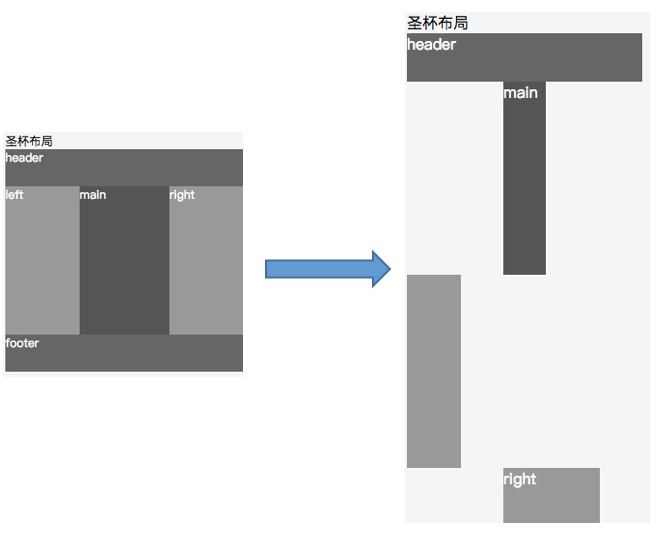

# CSS 布局

## 1 两列布局


## 2 三列布局
以下是我们常见的三列布局：


一般情况下，我们的布局框架使用以下写法，从上到下，从左到右。

``` html
<header>header</header>
<section>
  <aside>left</aside>
  <section>main</section>
  <aside>right</aside>
</section>
<footer>footer</footer>
```

然而，如果我们希望中部 main 部分优先显示的话，是可以做布局优化的。将 `<section>main</section>` 部分提前即可优先渲染。

``` html
<header>header</header>
<section>
    <section>main</section>
    <aside>left</aside>
    <aside>right</aside>
</section>
<footer>footer</footer>
```

### 2.1 绝对定位
``` html
<style>
/* 关键代码 */
header,footer { height: 50px;}
.wrapper { position: relative;}
.main { height: 200px; margin:0 100px;}
.left, .right{ width: 100px; height: 200px; position: absolute; top: 0;}
.left{ left: 0;}
.right{ right: 0;}
</style>

<header>header</header>
<section class="wrapper">
    <section class="col main">main</section>
    <aside class="col left">left</aside>
    <aside class="col right">right</aside>
</section>
<footer>footer</footer>
```
绝对定位是最简单的一种三列布局方式，但是也存在一定的问题。那就是高度不可控，如果 left 部分的高度高于 main ，left 就没有能力撑起整个 wrapper 。而以下「圣杯」和「双飞翼」两种方式就能解决这个问题。

### 2.2 圣杯
``` html
<style>
/* 关键代码 */
header,footer {height: 50px;}
.wrapper {padding: 0 100px 0 100px; overflow:hidden;}
.col {position: relative; float: left;}
.main {width: 100%;height: 200px;}
.left {width: 100px; height: 200px; margin-left: -100%;left: -100px;}
.right {width: 100px; height: 200px; margin-left: -100px; right: -100px;}
</style>

<header>header</header>
<section class="wrapper">
  <section class="col main">main</section>
  <aside class="col left">left</aside>
  <aside class="col right">right</aside>
</section>
<footer>footer</footer>
```

使用了 relative 相对定位、float 和 负值 margin ，将 left 和 right 部分「安装」到 wrapper 的两侧，顾名「圣杯」。

圣杯布局在正常情况下是没有问题的，但是特殊情况下就会暴露此方案的弊端，如果将浏览器无线变窄，「圣杯」将会「破碎」掉。如图，当 main 部分的宽小于 left 部分时就会发生布局混乱。



于是，淘宝针对「圣杯」的缺点做了优化，并提出「双飞翼」布局。

### 2.3 双飞翼
``` html
<style>
/* 关键代码 */
header,footer {height: 50px;}
.wrapper {padding: 0; overflow:hidden;}
.col {float: left;}
.main {width: 100%;}
.main-wrap {margin: 0 100px 0 100px;height: 200px;}
.left {width: 100px; height: 200px; margin-left: -100%;}
.right {width: 100px; height: 200px; margin-left: -100px;}
</style>

<header>header</header>
<section class="wrapper">
  <section class="col main">
    <section class="main-wrap">main</section>
  </section>
  <aside class="col left">left</aside>
  <aside class="col right">right</aside>
</section>
<footer>footer</footer>
```

同样使用了 float 和 负值 margin,不同的是，并没有使用 relative 相对定位 而是增加了 dom 结构，增加了一个层级。确实解决了圣杯布局的缺陷。当然双飞翼布局存在 dom 结构多余，增加渲染树生成的计算量。

所以最后总结一下，那就是对症下药，没有最好的方案，只有最适合的。
