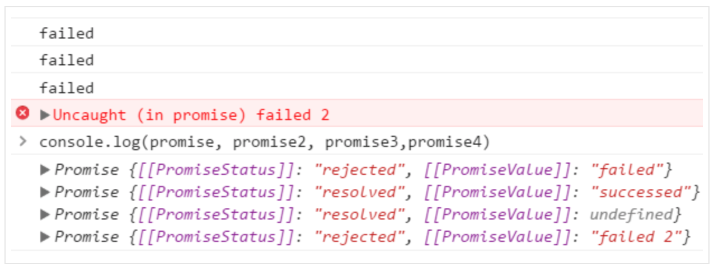

# Promises 详解
Promise 的出现，原本是为了解决回调地狱的问题。它允许你为异步代码执行结果的成功和失败分别绑定相应的处理方法。这让异步方法可以像同步方法那样返回值，但是并非立即返回执行的结果，而是返回一个 Promise 对象。

## 如何创建 Promises
和普通 JavaScript 对象一样，同样是通过`new`关键词来创建一个 Promise 对象实例。构造函数只接收一个参数，且该参数必须是一个函数，任何其他的值比如 undefined、null、true 等都会报一个 TypeError 的错误。同样，如果你没有通过`new`关键词创建，而是直接执行`Promise()`，同样也会报一个 TypeError 的错误。

``` js
var promise = new Promise(function(resolve, reject) {
    // 进行一些异步操作
    // 然后调用resolve或reject方法
});
```

创建Promise实例时传入的函数，同时还接受两个参数，它们分别对应Promise内部实现的两个方法。

## Promise 的原理分析
Promise 本质是一个状态机。每个 promise 只能是 3 种状态中的一种：

* pending：初始状态；
* fulfilled：操作成功，状态不可变，且需要有一个最终值；
* rejected：操作失败，状态不可变，且需要有一个拒绝原因。

pending 是对象创建后的初始状态，当对象操作成功时变为 fulfilled，当对象 操作失败时变为 rejected。状态转变只能是 pending -> fulfilled 或者 pending -> rejected，状态转变不可逆。

## Promise 实例方法介绍
Promise 对象拥有两个实例方法`then()`和`catch()`。 

### Promise.prototype.then(resolve, reject) 
每一个 promise 都会提供一个 then 方法，用于链式调用，每次执行时都会返回一个新的 promise 对象：

``` js
var promise = new Promise(function (resolve, reject) {
  if(/* 逻辑判断 */) { //异步操作成功
    resolve(result);
  } else { //异步操作失败
    reject(error);
  }
});

promise.then(function(result) {
  // 完成态，result 是上面 resolve 传入的值
  console.log(result);
}, function(error) {
  // 失败态，error 是上面 reject 传入的值
  console.log(error);
});
```

从上面这个例子可以看出 `then()` 接收两个参数，且通常都是函数。第二个参数是可选的，不一定要提供。当 promise 状态 fulfilled 时，会把 `resolve(value)` 中的 value 值传给 then 的第一个参数中，同理，当 promise 状态 reject 时，会把 `reject(reason)` 中的 reason 值传给 then 的第二个参数。


#### ES6 已经支持 Promise：

``` js
var promise = new Promise((resolve, reject) => {
  setTimeout(function() {
    resolve('完成');
  }, 10);
});

promise.then((msg) => {
  console.log('first messaeg: ' + msg); //first messaeg:完成
})
```

#### 深入理解 then 方法：

``` js
var promise = new Promise((resolve, reject) => {
  setTimeout(function() {
    resolve('完成');
  }, 10);
});

promise.then((msg) => {
  console.log('first messaeg: ' + msg); // first messaeg: 完成
}).then((msg) => {
  console.log('second messaeg: ' + msg); // second messaeg:undefined
});
```

输出两行信息：我们发现第二个 then 方法接收到的最终值是 undefined ，为什么呢？这是调用第一个 then 方法后，返回 promise 最终值为 undefined ，传递给第二个 then 的回调，如果把上面的例子稍加改动：

``` js
var promise = new Promise((resolve, reject) => {
  setTimeout(function() {
    resolve('完成');
  }, 10);
});

promise.then((msg) => {
  console.log('first messaeg: ' + msg); // first messaeg: 完成
  return msg + '第二次';
}).then((msg) => {
  console.log('second messaeg: ' + msg); // second messaeg:完成第二次
});
```

这次两个 then 方法的回调都接收到了最终值，正如我们前文所说，then 方法返回一个新 promise ，并且该新 promise 根据其传入的回调执行的返回值，进行决议，而函数未明确 return 返回值时，默认返回的是 undefined ，这也是上面实例第二个 then 方法的回调接收 undefined 参数的原因。

这里使用了链式调用，共产生三个 promise，初始 promise ，两个 then 方法分别返回一个 promise ；而第一个 then 方法返回的新 promise 是第二个 then 方法的主体，而不是初始 promise 。

再看下一个例子就能明白了：

``` js
var promise = new Promise((resolve, reject) => {
  setTimeout(() => resolve('1'), 1000);
});

promise.then( result => {
  console.log(result); //1
  return '2';
}).then( result => {
  console.log(result); //2
  return '3';
}).then( result => {
  console.log(result); //3
});
```

### Promise.prototype.catch(onRejected)
该方法为 promise 添加拒绝回调函数，将返回一个新 promise ，该新 promise 根据回调函数执行的返回值进行决议；若 promise 决议为完成状态，则新 promise 根据其最终值进行决议。

``` js
var promise = new Promise((resolve, reject) => {
  setTimeout(() => {
    reject('failed');
  }, 0);
});

var promise2 = promise.catch((reason) => {
  console.log(reason);
  return 'successed';
});

var promise3 = promise.catch((reason) => {
  console.log(reason);
});

var promise4 = promise.catch((reason) => {
  console.log(reason);
  throw 'failed 2';
});
```

输出如下图：


* catch 会为 promise 注册拒绝回调函数，一旦异步操作结束，调用了 reject 回调函数，则依次执行注册的拒绝回调；

* 另外有一点和 then 方法相似，catch 方法返回的新 promise 将使用其回调函数执行的返回值进行决议，如 promise2 , promise3 状态均为完成（resolved），但是 promise3 最终值为 undefined ，而 promise2 最终值为 successed ，这是因为在调用 `promise.catch` 方法时，传入的回调没有显式的设置返回值；

* 对于 promise4 ，由于调用 catch 方法时，回调中 throw 抛出异常，所以 promise4 状态为拒绝（rejected），拒绝原因为抛出的异常；

* 特别需要注意的是这里一共有四个 promise ，一旦决议，它们之间都是独立的，我们需要明白无论是 then 方法，还是 catch 方法，都会返回一个新 promise ，此新 promise 与初始 promise 相互独立。

* catch 方法和 then 方法的第二个参数一样，都是为 promise 注册拒绝回调。

### Promise.then() 链式写法
``` js
p1.then(function taskA(value) { 
  // task A
}).then(function taskB(vaue){
  // task B
}).catch(function onRejected(error){ //最后catch 统一捕捉异常
  console.log(error);
});
```

> 总结：调用 `.then()` 和 `.catch()` 时都会创建一个新的 Promise。这个新的 Promise 可以继续使用 then 或者 catch 方法。

## Promise静态方法
### Promise.resolve(value)
Promise.resolve(value) 可以认为是 new Promise() 方法的快捷方式。

``` js
//比如 Promise.resolve(666); 可以认为是以下代码的语法糖。
new Promise(function(resolve){ 
  resolve(666);
});
```

在这段代码中的 resolve(666);会让这个 promise 对象立即进入确定(即 resolved )状态,并将 666 传递给后面 then 里所指定的 onFulfilled 函数。

``` js
Promise.resolve(666).then(
  function (value) {
    console.log(value)  //666
  }
);
```

Promise.resolve 方法另一个作用就是将 thenable 对象转换为 promise 对象。

>> thenable对象：简单来说它就是一个非常类似 promise 的东西(就像我们有时称具有 `.length` 方法的非数组对象为 Arraylike 一样, thenable 指的是一个具有 `.then`  方法的对象。)  

* 最简单的例子就是 `jQuery.ajax()`,它的返回值就是 thenable 的,因为 `jQuery.ajax()` 的返回值是 jqXHRObject 对象,这个对象具有 `.then` 方法；
* 用 Promise.resolve 来转换为一个 promise 对象。变成了 promse 对象的话,就能直接使用 then 或者 catch 等这些在 ES6 Promises 里定 义的方法了。

``` js
var promise = Promise.resolve(
  $.ajax('/json/comment.json')
) // => promise对象 

promise.then(function(value){
  console.log(value); 
});
```

### Promise.reject(error)
Promise.reject(error) 是和 Promise.resolve(value) 类似的静态方法。

``` js
new Promise(
  function (resolve,reject) { 
    reject(new Error("出错了"));
  }
);

// 是Promise.reject(newError("出错了"))的语法糖。
//如下:
Promise.reject(new Error("出错了!")).catch(
  function(error){ 
    console.error(error);
  }
);
```

### Promise.all(iterable) 
接受一个或多个 promsie（以数组方式传递），返回一个新 promise，该 promise 状态取决于传入的参数中的所有 promsie 的状态：

* 当所有 promise 都完成是，返回的 promise 完成，其最终值为由所有完成 promsie 的最终值组成的数组；
* 当某一 promise 被拒绝时，则返回的 promise 被拒绝，其拒绝原因为第一个被拒绝 promise 的拒绝原因；

``` js
var p1 = new Promise((resolve, reject) => {
  setTimeout(function(){
    console.log('p1决议');
    resolve('p1');
  }, 10);
});

var p2 = new Promise((resolve, reject) => {
  setTimeout(function(){
    console.log('p2决议');
    resolve('p2');
  }, 10);
});

Promise.all( [p1, p2] )
  .then((msgs) => {
    // p1和p2完成并传入最终值
    console.log(JSON.stringify(msgs)); // ["p1","p2"]
  })
  .then((msg) => {
    console.log( msg );  // undefined
  });
```

### Promise.race(iterable) 
race 方法返回一个 promise ,只要传入的诸多 promise 中的任意一个完成或被拒绝，则该 promise 同样完成或被拒绝，最终值或拒绝原因也与之相同。

``` js
var p1 = new Promise((resolve, reject) => { 
  setTimeout(() => { 
    resolve(2) 
  }, 3000) 
}) 

var p2 = new Promise((resolve, reject) => { 
  setTimeout(() => { 
    resolve(3) 
  }, 2000) 
}) 

Promise.race([p1, p2])
  .then( (result) => console.log(result)) //2秒后显示3
  .catch( error => console.log(error.toString()))
```

## 案例
### 一、使用 promise 封装 ajax：

``` js
getData(method, url){
  var promise = new Promise(function(resolve, reject){
    var xmlHttp = new XMLHttpRequest();
    xmlHttp.open(method, url);
    xmlHttp.send();
    xmlHttp.onload = function () {
      if (this.status == 200 ) {
        resolve(this.responseText);
      } else {
        reject(this.statusText);
      }
    };
    xmlHttp.onerror = function () {
      reject(this.statusText);
    };
  })
  return promise;
}

getData('get','www.xxx.com').then(successFun, failFun);
```

### 二、解决回掉地狱的问题
如：

``` js
$.ajax({ 
  url: "/api1", 
  success: function(){
    $.ajax({ 
      url: "/api2", 
      success: function(){
        $.ajax({ 
          url: "/api3", 
          success: function(){
            //
          }
        });
      }
    });
  }
});
```

类似以上这样的回掉嵌套，代码结构很不直观，可读性比较差。然后使用 promise 来改造：

``` js
function p1() {
  var promise = new Promise(function(resolve,reject) {
    $.ajax({
      url:"/api1",
      success:function(data) {
        resolve(data)//在异步操作成功时调用
      }
    })
  })
  return promise
}

function p2(val) {
  var promise = new Promise(function(resolve,reject) {
    $.ajax({
      url:"/api2",
      data:val, //来自 p1 的参数
      success:function(data) {
        resolve(data) //在异步操作成功时调用
      }
    })
  })
  return promise
}

function p3(val) {
  var promise = new Promise(function(resolve,reject) {
    $.ajax({
      url:"/api3",
      data:val, //来自 p2 的参数
      success:function(data) {
        resolve(data) //在异步操作成功时调用
      }
    })
  })
  return promise
}

p1()
  .then(data => return p2(data))  //p1 的结果传给 p2 作为参数
    .then(data => return p3(data))  //p2 的结果传给 p3 作为参数
      .then(data => console.log(data))
```