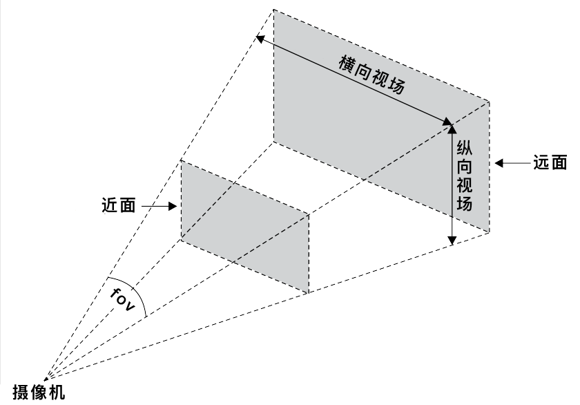
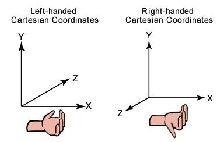

# Three.js入门
Three.js 是 JavaScript 编写的 WebGL 第三方库。Threejs 在底层其实还是调用 html5 中的 canvas api 来实现绘图的。但和我们一般绘制 2D 图像不同，Threejs 在底层使用的是 canvas 的 webgl context 来实现 3D 绘图。webgl context 本身更多是直接对 gpu 的操作，用起来相当不直观，为此 Threejs 在顶层对 3D 绘图所需的各种元素（例如场景，摄影机，灯光，几何图像，材质等）进行了封装，如果我们需要使用 Threejs 来绘图，只需要创建一个最小绘图环境即可，这个最小绘图环境包含了三个要素：

1. 场景 -- 包含所有需要显示的3D物体以及其他相关元素的容器（三维空间）；

2. 摄像机 -- 决定3D场景如何投影到2D画布之上（一个观察点，及其方向和角度）；

3. 渲染器 -- 用于最后绘制的画笔（渲染）,如何渲染出图像，是使用WegGL还是Canvas。

``` js
var scene = new THREE.Scene();  //创建场景

var camera = new THREE.PerspectiveCamera(75, window.innerWidth / window.innerHeight, 0.1, 1000);  //创建摄影机
camera.position.z = 8;

var renderer = new THREE.WebGLRenderer(); //创建渲染器
renderer.setSize(window.innerWidth, window.innerHeight);  //设置渲染器大小
renderer.setPixelRatio(window.devicePixelRatio);  //设置像素比，针对高清屏
renderer.setClearColor(0x000000, 1);  //设置默认背景色与透明度

document.body.appendChild(renderer.domElement);  //把画笔插入到dom中
```

## 渲染器
渲染器其实代表的是 `<canvas>` 标签。three.js 支持多种渲染器, 其中主要的为 CanvasRenderer 和 WebGLRenderer;

* WebGLRender：使用WebGL来渲染图形，速度较快，但是有些机器不支持WebGL。
* CanvasRender：使用canvas2d来渲染图形，在较老的版本上，主要是用来渲染2D图形。现在这个渲染器在新版本中已弃用。

``` js
// 创建一个 WebGL 渲染器
var renderer = new THREE.WebGLRenderer();

// 设置渲染器背景色与透明度
//renderer.setClearColor(0xffffdd);
renderer.setClearColor(0xffffdd,1);

//设置渲染器大小，分别代表宽高 100px
renderer.setSize(100, 100);

//设置像素比，针对高清屏
renderer.setPixelRatio(window.devicePixelRatio);

document.body.appendChild(renderer.domElement);
```

## 相机
相机定义了场景中哪部分是可以见的，相机有自己的位置（position）、朝向（lookAt）和可视域。我们创建的图形一定要放在相机的可视域中才能看得见。可视域与相机的类型、相机的位置和朝向都有关。


相机分为四种, 分别为：

* CubeCamera(全景相机)；
* OrthographicCamera（正交投影）；
* PerspectiveCamera（透视投影）；
* StereoCamera(3D相机)。

它们都继承自 Camera 类。常用的有两种，正交投影相机和透视投影相机。

### 透视投影（PerspectiveCamera）
使用透视投影相机获得的结果是类似人眼在真实世界中看到的有“近大远小”的效果。

``` js
// 创建一个具有透视效果的摄像机
var camera = new THREE.PerspectiveCamera(45, width / height, 0.1, 1000);

// 设置摄像机位置，并将其朝向场景中心
camera.position.x = 30;
camera.position.y = 10;
camera.position.z = 30;
camera.lookAt(scene.position);
```

THREE.PerspectiveCamera(fov, aspect, near, far) 具有 4 个参数，具体解释如下：

* fov : fov 表示视场，即摄像机能看到的视野。比如，人类有接近 180 度的视场，而有些鸟类有接近 360 度的视场。但是由于计算机不能完全显示我们能够所看到的景象，所以一般会选择一块较小的区域。对于游戏而言，视场大小通常为 60 ~ 90 度。

推荐默认值为：50

* aspect : 指定渲染结果的横向尺寸和纵向尺寸的比值。在我们的示例中，由于使用窗口作为输出界面，所以使用的是窗口的长宽比。

推荐默认值：window.innerWidth / window.innerHeight

* near(近平面) : 指定从距离摄像机多近的距离开始渲染。

推荐默认值：0.1

* far(远平面) : 指定摄像机从它所处的位置开始能看到多远。若过小，那么场景中的远处不会被渲染；若过大，可能会影响性能。

推荐默认值：1000



摄像机的 fov 属性指定了横向视场。基于 aspect 属性，纵向视场也就相应确定了。而近面和远面则指定了可视化区域的前后边界，即两者之间的元素才可能被渲染。

### 正交投影(OrthographicCamera)
他不具有透视效果，使用正交投影相机获得的结果其大小始终不变，所以远近的物体大小一样，即物体的大小不受远近距离的影响。

``` js
//六个参数即是指定视域的 左 右 上 下 近 远 六个范围。
OrthographicCamera( left, right, top, bottom, near, far )
```

### 全景相机
全景相机就是可以360度拍摄的相机，见过百度地图全景街景拍摄车的话，应该会有印象。在threejs中，全景相机构造也类似，使用六个不同方向上的相机同时拍摄，将拍摄的结果融合到同一个画面中。这有点像VR的概念，无论你看向画面的哪个方向，都能看到那个方向的景物。

### 3D相机
这个3D相机应该叫浮雕3D相机，它是用两个不同位置的透视相机同时拍摄，将拍摄的结果合成为一个画面。这便是早期3D电影的表现方法，通过让人的两只眼睛看到稍微不同的图像，来欺骗人的感觉，让人好像看到了立体一样。

## 坐标系
Three.js 采用右手坐标系。



坐标系的原点在画布中心（`canvas.width / 2`, `canvas.height / 2`）。我们可以通过 Three.js 提供的 `THREE.AxisHelper()` 辅助方法将坐标系可视化。

``` js
THREE.AxisHelper()
```

## Mesh(面)
Mesh 是网格模型，由若干三角面构成的图形。好比一个包装工，它将『可视化的材质』粘合在一个『数学世界里的几何体』上，形成一个『可添加到场景的对象』。

当然，创建的材质和几何体可以多次使用（若需要）。而且，包装工不止一种，还有 Points（点集）、Line（线/虚线） 等。

在创建物体时，需要传入两个参数，一个是几何形状（Geometry），另一个是材质（Material）。

``` js
var camera, scene, renderer;
var geometry, material, mesh;

init();
animate();

function init() {

    camera = new THREE.PerspectiveCamera(75, window.innerWidth / window.innerHeight, 1, 10000);
    camera.position.z = 1000;

    scene = new THREE.Scene();

    geometry = new THREE.BoxGeometry(200, 200, 200);
    material = new THREE.MeshBasicMaterial({
        color: 0xff0000,
        wireframe: true
    });

    mesh = new THREE.Mesh(geometry, material);
    scene.add(mesh);

    renderer = new THREE.WebGLRenderer();
    renderer.setSize(window.innerWidth, window.innerHeight);

    document.body.appendChild(renderer.domElement);

}
```

``` js

import { Mesh, MeshBasicMaterial, BoxGeometry } from ‘three’;

var scene = new Scene(); // 创建场景

var camera = new PerspectiveCamera(45, window.innerWidth / window.innerHeight, 1, 1000); // 创建摄影机
camera.position.z = 8;

var renderer = new WebGLRenderer(); // 创建渲染器
renderer.setSize(window.innerWidth, window.innerHeight); // 设置画布大小
renderer.setPixelRatio(window.devicePixelRatio); // 设置像素比，针对高清屏
renderer.setClearColor(0x000000, 1); // 设置默认背景色

document.body.appendChild(renderer.domElement); // 把画笔插入到dom中
    
var geometry = new BoxGeometry(1, 1, 1); // 创建一个长方体，用来定义物体的形状

var material = new MeshBasicMaterial({ color: 0xff0000 }); // 创建一个材质，用来定义物体的颜色

var mesh = new Mesh(geometry, material); // 使用形状和素材，来定义物体

scene.add(mesh);

renderer.render(scene, camera);
```

### 几何形状（Geometry）
常见的 Three.js 中几何形状包括立方体，柱体，球体等等。Geometry 通过存储模型中的点集和点间关系（哪些点构成一个三角形）来描述物体形状。因此我们也可以通过自己定义每个点的位置来构造形状。我们还可以通过导入外部的模型文件来构造更加复杂的形状。

#### BoxGeometry（长方体）
是四边形几何类, 它通常用给定的长宽高参数构造立方体或不规则四边形。

``` js
THREE.BoxGeometry(width, height, depth, widthSegments, heightSegments, depthSegments)
```

#### PlaneGeometry
是平面类, 其实是一个长方形，而不是数学意义上无限大小的平面。

``` js
THREE.PlaneGeometry(width, height, widthSegments, heightSegments)
```

#### ParametricGeometry
根据参数生成形状。

#### PolyhedronGeometry
多面体。

#### ShapeGeometry（二维形状）

#### SphereGeometry（球体）
球体类, 其中需要注意的是在使用时可以根据经纬度切片数来定制球形外形, 可以通过经纬度弧度来定制球形起始形状。

``` js
THREE.SphereGeometry(radius, segmentsWidth, segmentsHeight, phiStart, phiLength, thetaStart, thetaLength)
```

* radius 是半径； 

* segmentsWidth 表示经度上的切片数；

* segmentsHeight 表示纬度上的切片数；

* phiStart 表示经度开始的弧度；

* phiLength 表示经度跨过的弧度；

* thetaStart 表示纬度开始的弧度； 

* thetaLength 表示纬度跨过的弧度

#### CircleGeometry（圆形）
可以创建圆形或者扇形。

``` js
THREE.CircleGeometry(radius, segments, thetaStart, thetaLength)
```

#### CylinderGeometry（圆柱体）
柱体类。

``` js
THREE.CylinderGeometry(radiusTop, radiusBottom, height, radiusSegments, heightSegments, openEnded)
```

* radiusTop 与 radiusBottom 分别是顶面和底面的半径，由此可知，当这两个参数设置为不同的值时，实际上创建的是一个圆台； 

* height 是圆柱体的高度； 

* radiusSegments 与 heightSegments 可类比球体中的分段； 

* openEnded 是一个布尔值，表示是否没有顶面和底面，缺省值为false，表示有顶面和底面

#### TetrahedronGeometry
正四面体。

``` js
THREE.TetrahedronGeometry(radius, detail)
```

#### OctahedronGeometry
正八面体。

``` js
THREE.OctahedronGeometry(radius, detail)
```

#### DodecahedronGeometry（十二面体）

#### IcosahedronGeometry
正二十面体。

``` js
THREE.IcosahedronGeometry(radius, detail)
```

#### TorusGeometry（圆环体）
也为甜甜圈的形状。

``` js
THREE.TorusGeometry(radius, tube, radialSegments, tubularSegments, arc)
```

#### TorusKnotGeometry（换面纽结体）
圆环结, 形如打了结的甜甜圈。

``` js
THREE.TorusKnotGeometry(radius, tube, radialSegments, tubularSegments, p, q, heightScale)
```

#### TubeGeometry（管道）

#### ConeGeometry（圆锥体）
锥形几何类。

``` js
THREE.ConeGeometry(radius, height, radialSegments, heightSegments, openEnded, thetaStart, thetaLength)
```

#### RingGeometry（环形）

#### LatheGeometry
让任意曲线绕 y 轴旋转生成一个形状，如花瓶。

#### ExtrudeGeometry
则是将一个二维图形沿 z 轴拉伸出一个三维图形。

``` js
THREE.ExtrudeGeometry(shapes, options)
```

#### EdgesGeometry

#### WireframeGeometry
EdgesGeometry 和 WireframeGeometry 更多地可能作为辅助功能去查看几何体的边和线框（三角形图元）。

#### TextGeometry 
TextGeometry 则需要从外部加载特定格式的字体文件（可在 typeface.js 网站上进行转换）进行渲染，其内部依然使用 ExtrudeGeometry 对字体进行拉伸，从而形成三维字体。另外，该类字体的本质是一系列类似 SVG 的指令。所以，字体越简单（如直线越多），就越容易被正确渲染。

### 材质（ Material ）
这里的材质不仅仅指物体纹理，而是物体表面除了形状以外所有可视属性的集合，例如色彩、纹理、光滑度、透明度、反射率、折射率、发光度。 

讲到材质（ Material ），就还需要再讲一下贴图（ Map ）、纹理（ Texture ）。 
材质上面已经提到了，它包括了贴图以及其它。 
贴图其实是“贴”和“图”，它包括了图片和图片应当贴到什么位置。 
纹理嘛，其实就是“图”了。 
Three.js 提供了多种材质可供选择，能够自由地选择漫反射 / 镜面反射等材质。

材质与图形表示方法是相关的，用点表示使用 PointsMaterial ，用线表示使用 LineXXXMaterial ，用面表示使用 MeshXXXMaterial ，用精灵表示使用 SpriteMaterial 等等。

这样划分是因为不同的表示方式所要求的材质有很大不同。比如用线来表示，由于线没有光照模型，所以，LineXXXMaterial 也没有关照类的属性。只有面表示的模型才有光照模型。光照模型有 lambert 模型和 phong 模型，对这两种光线模型，我们只需要知道，Lambert 模型一般用来表示只有漫反射的物体，如塑料，而 phong 模型用来表示有镜面反射的物体，如镜子。

### 纹理（ Texture ）

纹理是用来表现图形的一些微小细节的。理论上讲，一个图形所有的细节都可以用点线面表示出来，但是这么做需要巨量的点线面，计算速度十分的慢，所以，在细节上，可以使用纹理。

在 threejs 中使用 Texture 来表示纹理，纹理可以从图片中加载，也可以从 canvas 中加载，所以，纹理能表示的图像很丰富。

## Points(点)
点或点云，可以用点或点云表示图形

## Line/LineSegments(线)
直线和虚线，可以用线或线团表示图形

## Sprite(精灵)
Sprite在threejs中定义为“一个永远面向相机的平面，通常用来加载纹理”，其最重要的特点是永远面向相机，这在某些时候很有用。注意一下，所有图形都是面向相机的。

## Bone(骨骼)
骨骼相当于图形的控制单元，控制骨骼运动，就能带动骨骼上附着的图形的运动。

## Skeleton(骨架)
由多根骨骼组成。

## SkinnedMesh(皮肤)
附着在骨骼上的图形。

## lensFlare(光晕)

## LOD(细节级别)
这个挺重要的。当模型很大时，可以使用LOD技术，基于模型到相机的距离简化模型，以此来提高性能。简单的说就是，离得近的模型，顶点多一些，离得远的模型，顶点少一些。

## Group(组)
可以将多个对象打包成一个组，便可统一操作（移动、旋转等等）。

## 光与影
three.js 中提供了多种光源模型：环境光（AmbientLight）、点光源（PointLight）、聚光灯（SpotLight）、方向光（DirectionalLight）、半球光（HemisphereLight）等。

在 Three.js 中，能形成阴影的光源只有 `THREE.DirectionalLight` 与 `THREE.SpotLight`；而相对地，能表现阴影效果的材质只有 `THREE.LambertMaterial` 与 `THREE.PhongMaterial`。因而在设置光源和材质的时候，一定要注意这一点。

``` js
// 添加环境光
scene.add(new THREE.AmbientLight(0x3f2806));

// 添加方向光
var light = new THREE.DirectionalLight(0xffffff, 1);
light.position.set(0, 100, 100);
scene.add(light);
```

## 矩阵变换
在三维图形学中,几何变换大致分为三种,平移变换(Translation),缩放变换(Scaling),旋转变换(Rotation)。

* 矩阵 - opengl-tutorial

* Matrix4 - three.js

* 三维顶点为三元组(x,y,z),引入一个新的分量w，得到向量(x,y,z,w): 若w=1，则向量(x, y, z, 1)为空间中的点;若w=0，则向量(x, y, z, 0)为方向;

* 三维图形学中我们只用到4x4矩阵，它能对顶点(x,y,z,w)作变换。这一变换是用矩阵左乘顶点来实现的：矩阵*顶点= 变换后的顶点;

* 将三维空间中的一个点 [x, y, z, 1] 移动到另外一个点 [x', y', z', 1] ，三个坐标轴的移动分量分别为 dx=Tx, dy=Ty, dz=Tz;

* 平移变换矩阵的逆矩阵与原来的平移量相同但是方向相反;

* 旋转变换矩阵的逆矩阵与原来的旋转轴相同但是角度相反;

* 缩放变换的逆矩阵正好和原来的效果相反，如果原来是放大，则逆矩阵是缩小，如果原来是缩小，则逆矩阵是放大;

* 累积变换的顺序: 先缩放,接着旋转,最后平移;

## 声音
为什么 Three.js 不是游戏引擎，却带个音频呢？原来这个音频也是 3D 的，它会受到摄像机的距离影响：

* 声源离摄像机的距离决定着声音的大小。
* 摄像机左右侧的位置分布决定着左右扬声器声音的大小。

## 阴影
阴影是增强三维场景效果的重要因素，但 Three.js 出于性能考虑，默认关闭阴影。下面我们来看看如何开启阴影的。

1、渲染器启用阴影

```js
renderer.shadowMap.enabled = true
```

2、指定哪个光源能产生阴影

``` js
// 并不是所有类型的光源能产生投影，不能产生投影的光源有：环境光（AmbientLight）、半球光（HemisphereLight）
spotLight.castShadow = true
```

3、指定哪个物体能投射阴影，哪个物体能接受阴影（在 CSS 中，我们都会认为只有背景接受阴影，毕竟它们都是平面）

``` js
// 平面和立方体都能接受阴影
plane.receiveShadow = true
cube.receiveShadow = true
// 球体的阴影可以投射到平面和球体上
sphere.castShadow = true
```

4、更改阴影质量

``` js
// 更改渲染器的投影类型，默认值是 THREE.PCFShadowMap
renderer.shadowMap.type = THREE.PCFSoftShadowMap
// 更改光源的阴影质量，默认值是 512
spotLight.shadow.mapSize.width = 1024 
spotLight.shadow.mapSize.height = 1024
```

## 雾化效果
雾化效果是指：场景中的物体离得越远就会变得越模糊。目前，Three.js 提供两种雾化效果：

``` js
// Fog( hex, near, far )，线性雾化。
// near 表示哪里开始应用雾化效果
// far 表示雾化效果在哪里结束
scene.fog = new THREE.Fog( 0xffffff, 0.015, 100 )
// FogExp2( hex, density )，指数雾化
// density 是雾化强度
scene.fog = new THREE.FogExp2( 0xffffff, 0.01 )
// 雾化效果默认是全局影响的，若某个材质不受雾化效果影响，则可为材质的 fog 属性设置为 false（默认值 true）
var material = new THREE.Material({
    fog: false
})
```

## 渲染器剔除模式（Face culling）
CSS3 有一个 backface-visibility 属性，它指定当元素背面朝向用户时，该元素是否可见。因为元素背面的背景颜色是透明的，所以当其可见时，就会显示元素正面的镜像。

而在 Three.js 中，材质默认只应用在正面（THREE.FrontSide），即当你旋转物体（或摄像机）查看物体的背面时，它会因为未被应用材质而变得透明（即效果与 CSS3 backface-visibility: hidden 一样）。因此，当你想让物体正反两面均应用材质，则需要在创建材质时声明 side 属性为 THREE.DoubleSide：

``` js
var material = new THREE.MeshBasicMaterial({
    side: THREE.DoubleSide // 其他值：THREE.FrontSide（默认值）、THREE.BackSide
});
```

当然，为几何体正反两面均应用材质时，会让渲染器做更多工作，从而影响性能。同理，对于 CSS3，若对动画性能有更高的追求，则可以尝试显示地为 transform 动画元素设置其背面不可见 backface-visibility: hidden;，这样也许能提高性能。

## 其他
### 自适应屏幕（窗口）大小
``` js
window.addEventListener('resize', onResize, false)
function onResize () {
    // 设置透视摄像机的长宽比
    camera.aspect = window.innerWidth / window.innerHeight
    // 摄像机的 position 和 target 是自动更新的，而 fov、aspect、near、far 的修改则需要重新计算投影矩阵（projection matrix）
    camera.updateProjectionMatrix()
    // 设置渲染器输出的 canvas 的大小
    renderer.setSize(window.innerWidth, window.innerHeight)
}
```

### 粒子化
对于 Three.js，实现粒子效果的方法有两种：THREE.Sprite( material ) 和 THREE.Points( geometry, material )。而且这两者都会一直面向摄像机（无论你旋转摄像机还是设置粒子的 rotation 属性）。

基于 THREE.Sprite 实现:

``` js
function init() {
  // 获取浏览器窗口的宽高，后续会用
  var width = window.innerWidth
  var height = window.innerHeight

  // 创建一个场景
  var scene = new THREE.Scene()

  // 创建一个具有透视效果的摄像机
  var camera = new THREE.PerspectiveCamera(45, width / height, 0.1, 800)

  // 设置摄像机位置，并将其朝向场景中心
  camera.position.x = 0
  camera.position.y = 10
  camera.position.z = 200
  camera.lookAt(scene.position)

  // 创建一个 WebGL 渲染器，Three.js 还提供 <canvas>, <svg>, CSS3D 渲染器。
  var renderer = new THREE.WebGLRenderer({
    antialias: true
  })

  // 设置渲染器的清除颜色（即绘制下一帧前填充的颜色）和输出的 canvas 的尺寸
  renderer.setClearColor(0x000000)
  renderer.setSize(width, height)

  // 将渲染器的输出（此处是 canvas 元素）插入到 body
  document.body.appendChild(renderer.domElement)
  
  // 初始化摄像机插件（用于拖拽旋转摄像机，产生交互效果）
  var orbitControls = new THREE.OrbitControls(camera)
  orbitControls.autoRotate = true
  
  var spriteMaterial = new THREE.SpriteMaterial()
  // 循环创建多个 THREE.Sprite 对象，该对象始终面向摄像机
  for (var x = -5; x < 5; x++) {
    for (var y = -5; y < 5; y++) {
      var sprite = new THREE.Sprite(spriteMaterial)
      sprite.position.set(x * 10, y * 10, 0)
      scene.add(sprite)
    }
  }

  render()

  function render() {
    // 渲染，即摄像机拍下此刻的场景
    renderer.render(scene, camera)
    requestAnimationFrame(render)
  }

}
init()
```

当粒子数量较小时，一般不会存在性能问题。但随着数量的增长，就会很快遇到性能问题。此时，使用 THREE.Points 更为合适。因为 Three.js 不在需要管理大量 THREE.Sprite 对象，而只需管理一个 THREE.Points 对象。

基于 THREE.Points 实现:

``` js
function init() {
  // 获取浏览器窗口的宽高，后续会用
  var width = window.innerWidth
  var height = window.innerHeight

  // 创建一个场景
  var scene = new THREE.Scene()

  // 创建一个具有透视效果的摄像机
  var camera = new THREE.PerspectiveCamera(45, width / height, 0.1, 800)

  // 设置摄像机位置，并将其朝向场景中心
  camera.position.x = 0
  camera.position.y = 10
  camera.position.z = 200
  camera.lookAt(scene.position)

  // 创建一个 WebGL 渲染器，Three.js 还提供 <canvas>, <svg>, CSS3D 渲染器。
  var renderer = new THREE.WebGLRenderer({
    antialias: true
  })

  // 设置渲染器的清除颜色（即绘制下一帧前填充的颜色）和输出的 canvas 的尺寸
  renderer.setClearColor(0x000000)
  renderer.setSize(width, height)

  // 将渲染器的输出（此处是 canvas 元素）插入到 body
  document.body.appendChild(renderer.domElement)
  
  // 初始化摄像机插件（用于拖拽旋转摄像机，产生交互效果）
  var orbitControls = new THREE.OrbitControls(camera)
  orbitControls.autoRotate = true

  
  var geometry = new THREE.Geometry()
  var material = new THREE.PointsMaterial({
    size: 4,
    vertexColors: true, // 是否为几何体的每个顶点应用颜色，默认值是为所有面应用材质的颜色
    color: 0xffffff
  })

  for (var x = -5; x < 5; x++) {
    for (var y = -5; y < 5; y++) {
      var particle = new THREE.Vector3(x * 10, y * 10, 0)
      geometry.vertices.push(particle)
      geometry.colors.push(new THREE.Color(Math.random() * 0xffffff))
    }
  }
  // 相较于 THREE.Sprite，THREE.Points 更适合粒子数量多的情况。
  var points = new THREE.Points(geometry, material)
  scene.add(points)

  render()

  function render() {
    // 渲染，即摄像机拍下此刻的场景
    renderer.render(scene, camera)
    requestAnimationFrame(render)
  }

}
init()
```

由于 THREE.Points 的局限性（一个材质只能对应一种纹理），若想添加多种纹理，则需要创建相应个数的 THREE.Points 实例，而 THREE.Sprite 在此方面显得更灵活一些。

### 点击物体
鼠标作为 PC 端（移动端中的触摸）的主要交互方式，我们经常会通过它来选择页面上的元素。而对于 Three.js，它没有类似 DOM 的层级关系，并且处于三维环境中，那么我们则需要通过以下方式来判断某对象是否被选中。

``` js
function onDocumentMouseDown(event) {
    var vector = new THREE.Vector3(( event.clientX / window.innerWidth ) * 2 - 1, -( event.clientY / window.innerHeight ) * 2 + 1, 0.5);
    vector = vector.unproject(camera);
    var raycaster = new THREE.Raycaster(camera.position, vector.sub(camera.position).normalize());
    var intersects = raycaster.intersectObjects([sphere, cylinder, cube]);
    if (intersects.length > 0) {
        console.log(intersects[0]);
        
        intersects[0].object.material.transparent = true;
        intersects[0].object.material.opacity = 0.1;
    }
}
```

当点击鼠标时，上述代码会发生以下处理：

1. 基于屏幕上的点击位置创建一个 THREE.Vector3 向量。
2. 使用 vector.unproject 方法将屏幕上的点击位置转换成 Three.js 场景中的坐标。换句话说，就是将屏幕坐标转换成三维场景中的坐标。
3. 创建 THREE.Raycaster。使用 THREE.Raycaster 可以向场景中发射光线。在下述案例中，从摄像机的位置（camera.position）向场景中鼠标的点击位置发射光线。
4. 使用 raycaster.intersectObjects 方法来判断指定的对象中哪些被该光线照射到的。

上述最后一步会返回包含了所有被光线照射到的对象信息的数组（根据距离摄像机距离，由短到长排序）。数组的子项的信息包括有：

``` js
distance: 49.90470
face: THREE.Face3
faceIndex: 4
object: THREE.Mesh
point: THREE.Vector3

```
