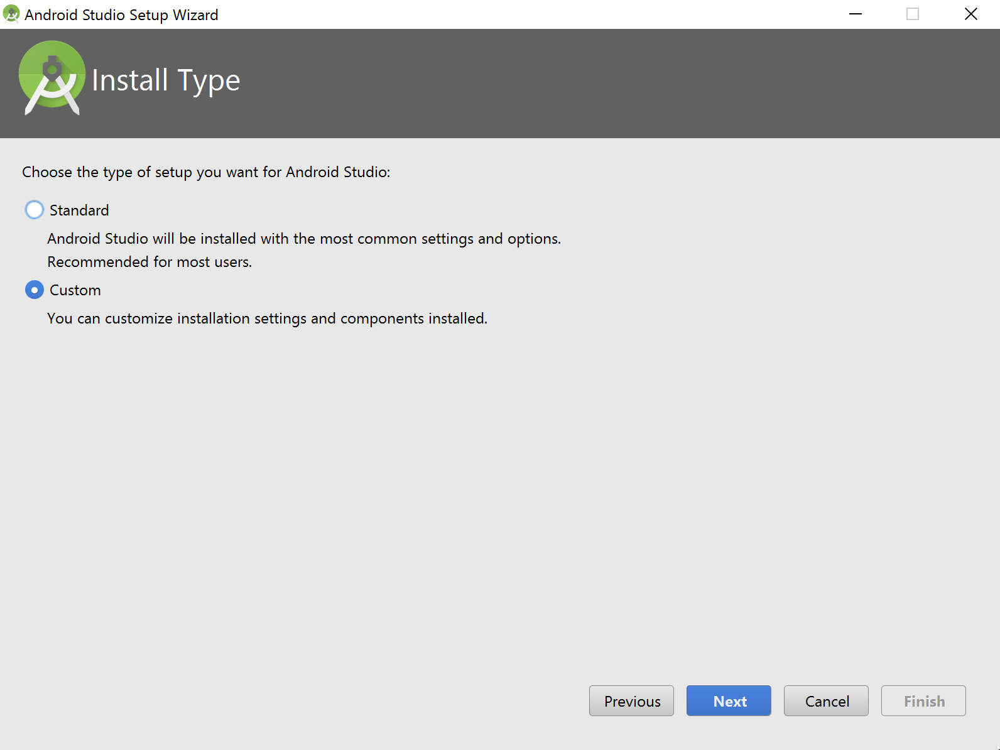
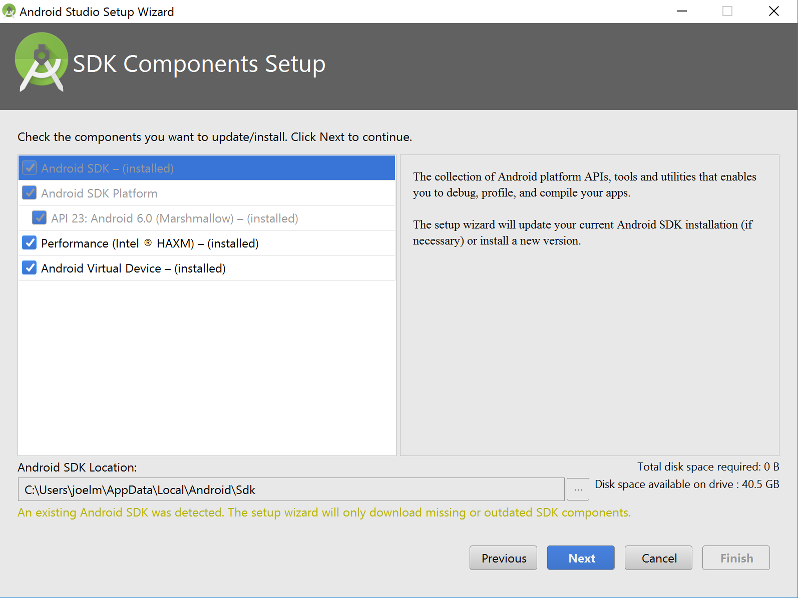
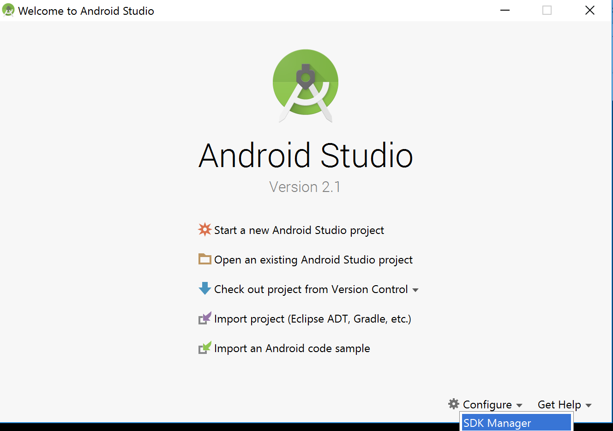
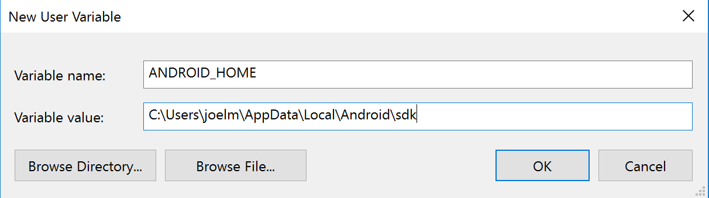
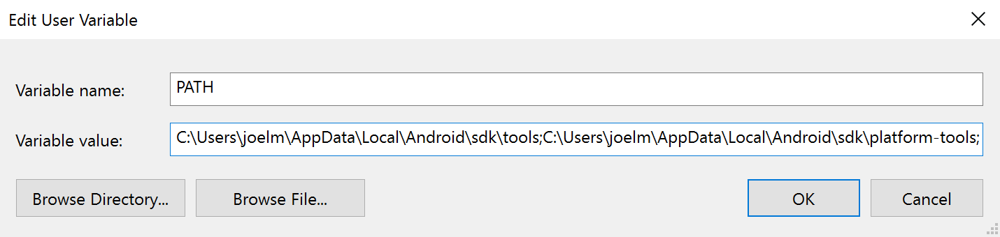

# React Native 超神之路
react native 目前最具潜力的移动端app解决方案。

目前 React-Native 支持iOS 7 和 Android 4.1(api 16) +

React Native不是基于WebView构建的WebAPP。React Native通过IOS和Android平台的JavaScriptCore.Framework，实现JavaScript与原生代码的交互。通过JavaScript驱动原生代码来构建APP，从而获得与原生代码开发的应用一致的优秀体验。

## 1 环境安装
### 1.1 window 系统 Android 开发环境搭建
#### 1.1.1 chocolatey（不是必须）
chocolatey 是一个 Windows 上的包管理器，要求用户系统 window7 以上。PowerShell 是 Chocolatey 实现包管理的主要依赖，大部分的命令都是通过 PowerShell 脚本实现的。Windows 7以上的系统中基本上都安装了 PowerShell，不过部分系统安装的版本比较低，如果想使用最新的版本，可以单独升级 PowerShell。

a. CMD.exe 方式安装

    @powershell -NoProfile -ExecutionPolicy Bypass -Command "iex ((new-object net.webclient).DownloadString('https://chocolatey.org/install.ps1'))" && SET PATH=%PATH%;%ALLUSERSPROFILE%\chocolatey\bin

b. PowerShell.exe 方式安装

    iex ((new-object net.webclient).DownloadString('https://chocolatey.org/install.ps1'))

c. PowerShell.exe V3+ 方式安装

    iwr https://chocolatey.org/install.ps1 -UseBasicParsing | iex

#### 1.1.2 安装Python 2（也可以直接官网下载,3.x版本不行）

    choco install python2

#### 1.1.3 安装node.js（也可以直接官网下载）

    choco install node

#### 1.1.4 安装yarn、react-native-cli

    npm install -g yarn react-native-cli

#### 1.1.5 Java Development Kit [JDK]
Android Studio需要Java Development Kit [JDK] 1.8或更高版本。[官网下载](http://www.oracle.com/technetwork/java/javase/downloads/index-jsp-138363.html) ，或者使用以下方式安装：

``` bash
# 安装、该过程可能需要越狱，下载安装过程比较慢，请耐心等待
choco install jdk8
# 或是 apt-get install default-jdk

#查看你当前安装的JDK版本
javac -version
```

##### 配置JAVA_HOME环境变量(如果直接官网下载安装是不需要这一步的)：
打开控制面板 -> 系统和安全 -> 系统 -> 高级系统设置 -> 高级 -> 环境变量 -> 新建

``` bash
# 选择PATH，编辑，添加以下代码：
C:\Program Files\java\jsk1.8.0_131\bin
```

#### 1.1.6 Android Studio
React Native 目前需要 Android Studio2.0 或更高版本，包含了运行和测试 React Native 应用所需的 Android SDK 和模拟器。

> 除非特别注明，请不要改动安装过程中的选项。比如 Android Studio 默认安装了 Android Support Repository，而这也是 React Native 必须的（否则在 react-native run-android 时会报 appcompat-v7 包找不到的错误）。

##### 安装步骤：
1. 确定所有安装都勾选了，尤其是 Android SDK 和 Android Device Emulator。
2. 在初步安装完成后，选择 Custom 安装项：



3. 检查已安装的组件，尤其是模拟器和HAXM加速驱动



4. 安装完成后，在Android Studio的欢迎界面中选择Configure | SDK Manager



5. 在SDK Platforms窗口中，选择Show Package Details，然后在Android 6.0 (Marshmallow)中勾选Google APIs、Android SDK Platform 23、Intel x86 Atom System Image、Intel x86 Atom_64 System Image以及Google APIs Intel x86 Atom_64 System Image。
6. 在SDK Tools窗口中，选择Show Package Details，然后在Android SDK Build Tools中勾选Android SDK Build-Tools 23.0.1（必须是这个版本）。然后还要勾选最底部的Android Support Repository.

##### 配置ANDROID_HOME环境变量：
打开控制面板 -> 系统和安全 -> 系统 -> 高级系统设置 -> 高级 -> 环境变量 -> 新建



> 具体的路径可能会不一致。

同时把Android SDK 的 tools 和 platform-tools 目录添加到 PATH 变量中，以便在终端中运行一些Android工具，例如android avd或是adb logcat等。

打开控制面板 -> 系统和安全 -> 系统 -> 高级系统设置 -> 高级 -> 环境变量 -> 选中PATH -> 双击进行编辑



#### 1.1.7 Gradle Daemon(推荐安装)
开启Gradle Daemon可以极大地提升java代码的增量编译速度。

#### 1.1.8 Git（可选）

#### 1.1.9 VirtualBox(可选，虚拟机)

#### 1.1.10 Genymotion（可选）
比起Android Studio自带的原装模拟器，[Genymotion](https://www.genymotion.com) 是一个性能更好的选择，但它只对个人用户免费。

1. 下载和安装 Genymotion（genymotion 需要依赖 [VirtualBox](https://www.virtualbox.org) 虚拟机，下载选项中提供了包含 VirtualBox 和不包含的选项，请按需选择）。
2. 打开 Genymotion 。如果你还没有安装 VirtualBox，则此时会提示你安装。
3. 创建一个新模拟器并启动。
4. 启动 React Native 应用后，可以按下F1来打开开发者菜单。

#### 1.1.11 Visual Studio Emulator for Android（可选）
Visual Studio Emulator for Android)是利用了Hyper-V技术进行硬件加速的免费android模拟器。也是Android Studio自带的原装模拟器之外的一个很好的选择。而且你并不需要安装Visual Studio。 在用于React Native开发前，需要先在注册表中进行一些修改：

1. 打开运行命令（按下Windows+R键）
2. 输入regedit.exe然后回车
3. 在注册表编辑器中找到HKEY_LOCAL_MACHINE\SOFTWARE\Wow6432Node\Android SDK Tools条目
4. 右键点击Android SDK Tools，选择新建 > 字符串值
5. 名称设为Path
6. 双击Path，将其值设为你的Android SDK的路径。（例如C:\Program Files\Android\sdk）

#### 1.1.12 测试
``` bash
# 该过程可能需要越狱，下载安装过程比较慢，请耐心等待
react-native init appProject
cd appProject

# 运行package（这一步不是必须的，因为 run-android 命令也会自动打开 package）
react-native start

# 浏览器访问 http://localhost:8081/index.android.bundle?platform=android，如果可以访问表示服务器端已经可以了。

# 保持packager开启，重新启动一个新的命令行，运行项目
react-native run-android
# 等待运行(如果是第一次运行，首先会下载gradle，时间较长)
```

> 首次运行需要等待数分钟并从网上下载gradle依赖。（这个过程屏幕上可能出现很多小数点，表示下载进度。这个时间可能耗时很久，也可能会不停报错链接超时、连接中断等等——取决于你的网络状况和墙的不特定阻断。总之要顺利下载，请使用稳定有效的科学上网工具。）

> 提示：你可以使用--version参数创建指定版本的项目。例如react-native init MyApp --version 0.39.2。注意版本号必须精确到两个小数点。

如果apk安装运行出现报错，请检查上文中安装SDK的环节里所有依赖是否都已装全，platform-tools 是否已经设到了 PATH 环境变量中，运行 adb devices 能否看到设备。

通过 USB 连接手机，应该能看到 APP 红屏报错，这是正常的，我们还需要让 app 能够正确访问 pc 端的 packager 服务。

摇晃设备或按 Menu 键（ Bluestacks 模拟器按键盘上的菜单键，通常在右 Ctrl 的左边 或者左 Windows 键旁边），可以打开调试菜单，点击 Dev Settings，选 Debug server host for device，输入你的正在运行 packager 的那台电脑的局域网IP加:8081（同时要保证手机和电脑在同一网段，且没有防火墙阻拦），再按 back 键返回，再按 Menu 键，在调试菜单中选择 Reload JS，就应该可以看到运行的结果了。

如果真实设备白屏但没有弹出任何报错，可以在安全中心里看看是不是应用的“悬浮窗”的权限被禁止了。

#### 1.1.13 安卓调试
打开 Chrome，访问 http://localhost:8081/debugger-ui，应当能看到一个页面。按F12打开开发者菜单。

在模拟器或真机菜单中选择 Debug JS，即可开始调试。


### 1.2 MacOS 系统 Android 开发环境搭建
#### 1.2.1 Homebrew
Mac 系统的包管理器，用于安装 NodeJS 和一些其他必需的工具软件。

``` bash
/usr/bin/ruby -e "$(curl -fsSL https://raw.githubusercontent.com/Homebrew/install/master/install)"

# 如果遇到相关权限问题。执行下面命令修复
sudo chown -R `whoami` /usr/local
```

#### 1.2.2 Node.js
``` bash
brew install node

# 设置npm镜像
npm config set registry https://registry.npm.taobao.org --global
npm config set disturl https://npm.taobao.org/dist --global
```

#### 1.2.3 Yarn、React Native的命令行工具
Yarn 是 Facebook 提供的替代 npm 的工具，可以加速 node 模块的下载。React Native 的命令行工具用于执行创建、初始化、更新项目、运行打包服务等任务。

``` bash
npm install -g yarn react-native-cli

# 设置yarn镜像源：
yarn config set registry https://registry.npm.taobao.org --global
yarn config set disturl https://npm.taobao.org/dist --global

# 遇到相关权限问题。执行下面命令修复:
sudo chown -R `whoami` /usr/local
```

#### 1.2.4 Java Development Kit [JDK]
1.8或更高版本。 [官网下载地址](http://www.oracle.com/technetwork/java/javase/downloads/index-jsp-138363.html)

#### 1.2.5 Android Studio
需要Android Studio2.0或更高版本。

##### 配置ANDROID_HOME环境变量：
在~/.bash_profile中添加:

``` bash
PATH="~/Library/Android/sdk/tools:~/Library/Android/sdk/platform-tools:${PATH}"
export PATH=$HOME/bin:/usr/local/bin:$PATH
export ANDROID_HOME=~/Library/Android/sdk
export PATH=${PATH}:${ANDROID_HOME}/tools
```

> 改完需要运行source ~/.bash_profile （注意：你的SDK的具体路径可能不同）

#### 1.2.6 Genymotion
将Android SDK的Tools目录添加到PATH变量中。

#### 1.2.7 VirtualBox

#### 1.2.8 Git

#### 1.2.9 watchman
watchman是Facebook用于监视JavaScript文件改动的开源项目。

``` bash
brew install watchman
```

#### 1.2.10 flow
flow是Facebook开源的一个JavaScript静态类型检查器，用于发现JavaScript程序中的类型错误。

``` bash
brew install flow
```

### 1.3 MacOS系统IOS开发环境搭建
#### 1.3.1 Homebrew

#### 1.3.2 Node.js

#### 1.3.3 React Native CLI

#### 1.3.4 watchman

#### 1.3.5 flow

#### 1.3.6 Xcode
相对于Android环境搭建，iOS简单太多了，上面环境安装好后，只需去Mac App Store下载Xcode，首次安装需要打开Xcode初始化。

#### 1.3.7 测试
在初始化项目好之后，只需在项目根目录运行下面命令即可：

``` bash
react-native run-ios
```