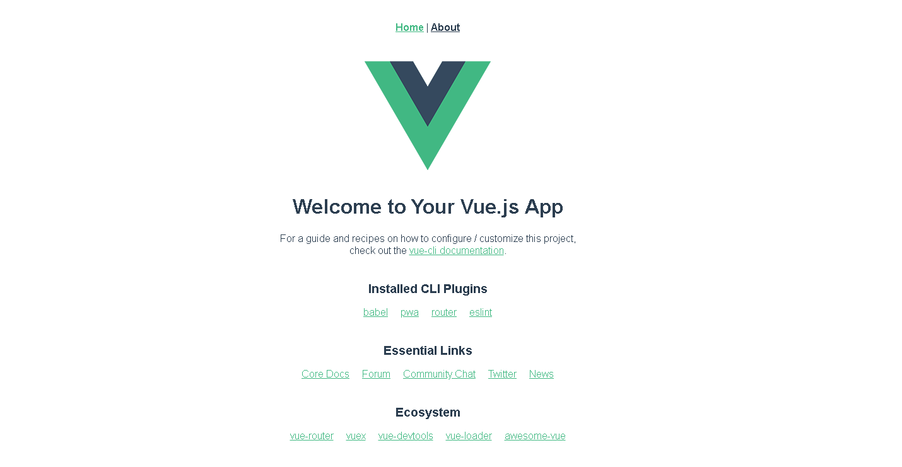
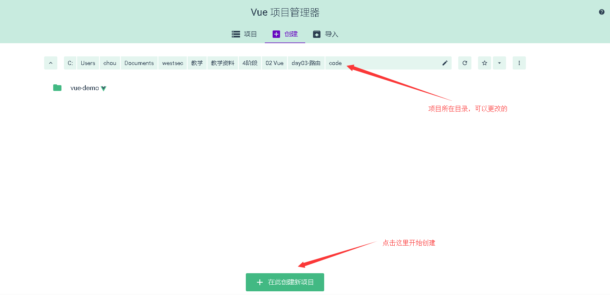
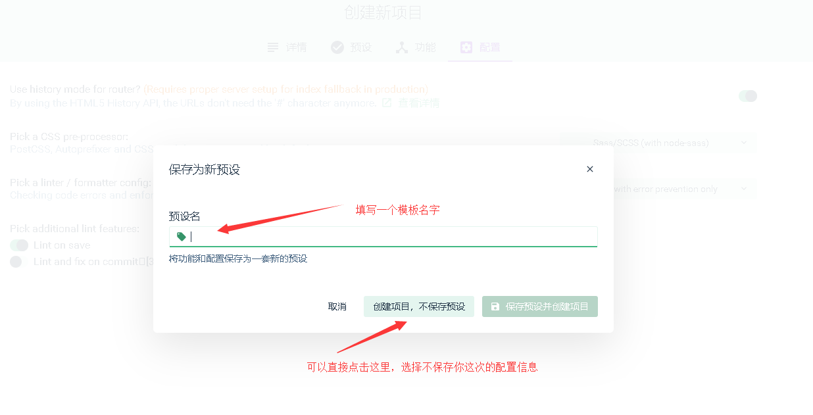

# Vue 开发环境

## 手动创建 Vue 的开发环境
vue-loader 是必须的，用于解析后缀名为 `.vue` 的文件，然后转换为 JavaScript 模块。vue-template-compiler 是 vue-loader 必须的依赖。

``` bash
npm install --save-dev vue-loader vue-template-compiler
```

``` js
//webpack 配置
module: {
  rules: [
    {
      test: /\.vue$/,
      loader: 'vue-loader',
      options: {
        loaders: {
          css: ["vue-style-loader", "css-loader"],
          less: ["vue-style-loader", "css-loader", "postcss-loader", "less-loader"]
        },
        cssSourceMap: true
      }
    },
    //使用vue-style-loader!css-loader!postcss-loader 处理以 css 结尾的文件！
    {
      test: /\.css$/,
      use: [
        "vue-style-loader",
          {
            loader: "css-loader",
	         options: {
	         sourceMap: true
	       }
	     },
	     {
	       loader: "postcss-loader",
	       options: {
	         sourceMap: true
	       }
	     }
	   ]
	 },
	 //使用vue-style-loader!css-loader!postcss-loader处理以less结尾的文件！
    {
      test: /\.less$/,
      use: [
        "vue-style-loader",
        {
          loader: "css-loader",
          options: {
            sourceMap: true
          }
        },
        {
          loader: "less-loader",
          options: {
            sourceMap: true
          }
        },
        {
          loader: "postcss-loader",
          options: {
            sourceMap: true
          }
        }
      ]
    }
  ]
}
```

## 脚手架：vue-cli
Vue.js 提供一个官方命令行工具，可用于快速搭建大型单页应用。

	# 全局安装 vue 的脚手架	
	npm install -g vue-cli
	
	# 查看版本号，判断是否安装成功
	vue -V
	
	# 创建一个基于 webpack 模板的新项目，项目名字叫 my-project
	vue init webpack my-project
	cd my-project
	
	# 安装依赖（这里一定要从官方仓库安装，而不是国内镜像cnpm安装否则会导致后面缺了很多依赖库）
	npm install
	
	# 运行
	npm run dev

> 注意，目前提供了4套官方模板：

* browserify
* browserify-simple
* webpack
* webpack-simple（初始是没有vue-router的，需要另外安装）

目录结构：

```
|-- build                            // 项目构建(webpack)相关代码
|   |-- build.js                     // 生产环境构建代码
|   |-- check-version.js             // 检查 node、npm 等版本
|   |-- dev-client.js                // 热重载相关
|   |-- dev-server.js                // 构建本地服务器
|   |-- utils.js                     // 构建工具相关
|   |-- vue-loader.conf.js           // vue-loader 基础配置
|   |-- webpack.base.conf.js         // webpack 基础配置
|   |-- webpack.dev.conf.js          // webpack 开发环境配置
|   |-- webpack.prod.conf.js         // webpack 生产环境配置
|-- config                           // 项目开发环境配置
|   |-- dev.env.js                   // 开发环境变量
|   |-- index.js                     // 项目一些配置变量
|   |-- prod.env.js                  // 生产环境变
|   |-- test.env.js                  // 测试环境变量
|-- node_modules                     // 存放 npm 下载的模块
|-- src   这是我们经常会用的一个文件夹    // 源码目录
|   |-- assets                       // 存放静态资源文件会被 webpack 处理解析为模块依赖
|   |-- components                   // vue 公共组件
|   |-- store                        // vuex 的状态管理
|   |-- router                       // 路由管理文件
|   |-- App.vue                      // 页面入口文件
|   |-- main.js                      // 程序入口文件，加载各种公共组件
|-- static                           // 静态文件，比如一些图片，json 数据等
|-- test                             // 测试文件
|-- .babelrc                         // ES6 语法编译配置
|-- .postcssrc                       // postcss 配置
|-- .editorconfig                    // 编辑器配置，定义代码格式
|-- .gitignore                       // git 上传需要忽略的文件格式
|-- README.md                        // 项目说明
|-- favicon.ico 
  |-- index.html                     // 入口页面
|-- package.json                     // 项目基本信息
|-- package-lock.json                // 锁定安装时的包的版本号

static 放不会变动的文件 assets 放可能会变动的文件。
```

## vue-cli 3.0
vue-cli 是 vue 官方的一个快速开发工具，可用于快速搭建大型单页应用。目前最新的 vue-cli 已经改名为 @vue/cli 了。

### 安装

打开终端（cmd）执行以下命令：

``` bash
npm install -g @vue/cli
# 如果安装了 yarn 则可以使用这条命令
yarn add global @vue/cli
```

### 创建项目
``` bash
vue create <project-name>
```

`<project-name>` 这里填写项目的名字（非中文），然后根据提示选择即可，注意新版本把插件以及模板等移植到命令行界面了。

当第一次选择的时候有两个选项（版本不同可能有细微差别）：default(默认配置)和 Manually select features(自定义配置)。

``` bash
Vue CLI v4.0.5
? Please pick a preset:    
  default (babel, eslint)  
> Manually select features 
```

default 的配置我就不说了，基本没有修改的地方，主要讲一下 Manually select features ，通过键盘上下方向键，选中 Manually select features 然后敲击回车进入下一步：

``` bash
? Please pick a preset: Manually select features
? Check the features needed for your project: (Press <space> to select, <a> to toggle all, <i> to invert selection)
>(*) Babel
 ( ) TypeScript
 (*) Progressive Web App (PWA) Support
 ( ) Router
 ( ) Vuex
 (*) CSS Pre-processors
 (*) Linter / Formatter
 ( ) Unit Testing
 ( ) E2E Testing
```

这里是用于选择你需要用到的插件，通过上下方向键移动，然后敲空格键选择，选完之后按回车，这里选择的插件不同，下一步会根据你选择的插件进行配置，所以下一步的界面也会有细微的不同，我这里就不详细说明，直接贴上我的选择：

``` bash
Vue CLI v4.0.5
? Please pick a preset: Manually select features
? Check the features needed for your project: Babel, PWA, Router, CSS Pre-processors, Linter
? Use history mode for router? (Requires proper server setup for index fallback in production) Yes
? Pick a CSS pre-processor (PostCSS, Autoprefixer and CSS Modules are supported by default): Sass/SCSS (with node-sass)
? Pick a linter / formatter config: Basic
? Pick additional lint features: (Press <space> to select, <a> to toggle all, <i> to invert selection)Lint on save
? Where do you prefer placing config for Babel, PostCSS, ESLint, etc.? In dedicated config files
? Save this as a preset for future projects? No
```

最后设置完毕后，就会进行环境安装，耐心等待即可。

### 启动项目

装好之后，就可以直接运行项目了：

``` bash
# 先进入项目
cd project-name

# 然后运行
npm run serve
# or
yarn serve
```

然后根据终端的提示，打开地址预览（一般是 http://localhost:8080 ）。



如果看到这样的界面，就说明环境搭建成功。

### 插件
在现有的项目中安装插件，可以使用 `vue add` 命令：

``` bash
vue add eslint
# 会解析为完整的包名 @vue/cli-plugin-eslint
```

如果安装的插件不存在，则会失败。

另外 vue add 中还有两个特例，如下：

``` bash
# 安装 vue-router
vue add router

# 安装 vuex
vue add vuex
```

这两个命令会直接安装 vue-router 和 vuex 并改变你的代码结构。

### 配置
与` vue-cli2.0` 的很大区别是根目录下的 webpack 配置的目录不见了，如果需要自定义配置，则需要在根目录下创建 `vue.config.js`` 文件，包括了配置 常用的输出路径名、跟目录、预处理、devServer 配置、pwa、dll、第三方插件等。 [官网配置](https://cli.vuejs.org/zh/config/)

``` js
  // vue.config.js
  module.exports = {
    // 去掉文件名中的 hash
    filenameHashing: false,
    // 如果你的应用被部署在 https://www.faychou.cn/my-app/，则设置 publicPath 为 /my-app/
    publicPath: '/', // 部署应用包时的基本 URL，Default: '/'
    // publicPath: '/blog' 如果部署到 https://www.faychou.cn/blog
    outputDir: 'dist', // 生产环境构建文件的目录，Default: 'dist'
    assetsDir: '', // 放置生成的静态资源 (js、css、img、fonts) 的 (相对于 outputDir 的) 目录，默认 ''
    devServer: {
      proxy: {
        '/api': { // 请求中不带 api
	        target: 'http://localhost:3131',
          changeOrigin: true, // 本地会虚拟一个服务端接收你的请求并代你发送该请求
	        pathRewrite: {'^/api' : ''}
	      }
      }
    }
  }
```

### 图形化界面
vue-cli 3.0 及以上版本有个最大的特点在于实现了图形界面化创建和操作项目，所以上面的方法大家理解起来很费劲的话，直接看这个部分也是可以滴。

依旧需要在终端中运行一条命令，用于启动，但是相对以上来讲，很简单了：

``` bash
vue ui
```

启动成功后就会看到这样的界面：


分为三个部分，这个很容易理解的，我们选择中间的创建按钮，设置项目所在目录后，直接点击下方的创建：



设置好项目名字，点击下一步：


选择手动配置，下一步：


根据项目情况有选择的设置即可：


根据配置不同，这里会有细微差别：


最后一步，就是询问你是否将这次的配置信息保存为一个模板，下次再创建 vue 项目时，就可以在第一步时直接选择这次的配置，我一般不保存。



到这里，环境配置就结束了，静态片刻之后，就可以直接运行项目。


在该界面中就可以查看当前依赖，添加新的插件，或者修改项目的配置信息，如果要运行项目，参照以下步骤即可完成。


### 零配置启动一个 vue

最后讲一个零配置的环境搭建，第一步安装模块：

``` bash
npm install -g @vue/cli-service-global
```

第二步：新建文件夹，并建立 app.vue：

``` html
<template>
  <h1> {{msg}} </h1>
</template>

<script>
  export default {
    data: {
      msg: 'hello world!'
    }
  }
</script>
```

第三步，启动文件：

``` bash
vue serve App.vue # 启动服务

vue build App.vue # 打包出生产环境的包并用来部署
```

通过这个功能，可以只用一个 vue 文件就能建立一个项目，不需要其他任意的配置，非常适合用于开发一个库、组件，做一些小 demo 等。

## 开发工具
vue-devtools