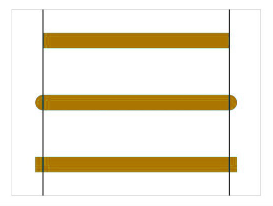

# Canvas
Canvas 是 HTML5 新增的组件，它就像一块画布，可以用 JavaScript 在上面绘制各种图像图表、动画等。

Internet Explorer 9+ 支持。

### 可以实现的功能
* 绘制各种图表、动画

## 起步
### 创建画布
指定尺寸的矩形框，在这个范围内我们可以随意绘制。默认  width 为 300、height 为 150，单位都是 px。

``` html
<canvas id="canvas" width="300" height="200">
  <p>您的浏览器不支持 Canvas。</p>
</canvas>
```

> 注意：建议永远不要使用 css 属性来设置 `<canvas>` 的宽高。

### 检测浏览器是否支持
``` js
const canvas = document.getElementById('canvas');

if (canvas.getContext) {
  console.log('您的浏览器支持 Canvas!');
} else {
  console.log('您的浏览器不支持 Canvas!');
}
```

### 尺寸

canvas 是一个二维网格，以左上角坐标为(0,0)，默认大小为 300像素 × 150像素（宽 × 高），也可以设置 width 和 height 来自定义尺寸，默认画布是透明的，是不可见的。

canvas 的默认大小为 300像素 × 150像素（宽 × 高），也可以设置 width 和 height 来自定义尺寸，默认画布是透明的，是不可见的。

canvas 元素有两套尺寸：一个是元素本身的大小(通过 CSS 设置)，另一个是元素绘图表面的大小(通过 canvas 自身的 width 和 height 属性设置)。

通过 CSS 修改 width 和 height，只是改变了元素本身大小，对元素绘图表面的大小并无影响;而通过修改属性 width 和 height，则会同时改变元素本身大小和绘图表面大小。

### 2D 画布

通过 getContext('2d') 方法获取 渲染上下文对象 context，所有的绘图操作都基于这个对象完成。

``` js
const canvas = document.getElementById('canvas');

if (canvas.getContext) {
  console.log('您的浏览器支持 Canvas!');
  const ctx = canvas.getContext('2d'); // 2D渲染上下文
  console.log('接下来您可以开始绘制图形了');
} else {
  console.log('您的浏览器不支持 Canvas!');
}
```

## 基本图形绘制
### 矩形
原生的矩形图形绘制。

``` js
// 语法：绘制一个填充的矩形
ctx.fillRect(x, y, width, height);

// 语法：绘制一个矩形的边框
ctx.strokeRect(x, y, width, height);
```

使用方法：

``` js
ctx.fillStyle = '#dddddd'; // 设置颜色
ctx.fillRect(10, 10, 130, 130); // 把(10,10)位置大小为130x130的矩形涂色
```

### 擦除
清除指定的矩形区域，然后这块区域会变的完全透明。

``` js
// 语法
ctx.clearRect(x, y, width, height)

// 使用方法
ctx.clearRect(0, 0, 200, 200);
```

### 样式控制
``` js
// 设置图形的填充颜色
ctx.fillStyle = color

// 设置图形轮廓的颜色
ctx.strokeStyle = color
```

> 注意：

1. color 可以是表示 css 颜色值的字符串、渐变对象或者图案对象。
2. 默认情况下，线条和填充颜色都是黑色。
3. 一旦您设置了 strokeStyle 或者 fillStyle 的值，那么这个新值就会成为新绘制的图形的默认值。如果你要给每个图形上不同的颜色，你需要重新设置 fillStyle 或 strokeStyle 的值。

``` js
 for (var i = 0; i < 6; i++) {
  for (var j = 0; j < 6; j++) {
  ctx.fillStyle = 'rgb(' + Math.floor(255 - 42.5 * i) + ',' +
    Math.floor(255 - 42.5 * j) + ',0)';
    ctx.fillRect(j * 50, i * 50, 50, 50);
  }
}
```

``` js
// 线宽,只能是正值,默认是1.0。
ctx.lineWidth = 5

// 设定线条与线条间接合处的样式,共有3个值round, bevel 和 miter
lineJoin = type
```

lineCap 属性，定义线条的端点样式：

定义线条的端点样式：

* butt：默认值，端点是垂直于线段边缘的平直边缘。
* round：端点是在线段边缘处以线宽为直径的半圆。
* square：端点是在选段边缘处以线宽为长、以一半线宽为宽的矩形



lineJoin 属性，定义两条线相交产生的拐角，也称为连接：

* round：通过填充一个额外的，圆心在相连部分末端的扇形，绘制拐角的形状。 圆角的半径是线段的宽度。
* bevel：在相连部分的末端填充一个额外的以三角形为底的区域， 每个部分都有各自独立的矩形拐角。
* miter(默认)：通过延伸相连部分的外边缘，使其相交于一点，形成一个额外的菱形区域。


``` js
var lineJoin = ['round', 'bevel', 'miter'];
  ctx.lineWidth = 20;

for (var i = 0; i < lineJoin.length; i++){
  ctx.lineJoin = lineJoin[i];
  ctx.beginPath();
  ctx.moveTo(50, 50 + i * 50);
  ctx.lineTo(100, 100 + i * 50);
  ctx.lineTo(150, 50 + i * 50);
  ctx.lineTo(200, 100 + i * 50);
  ctx.lineTo(250, 50 + i * 50);
  ctx.stroke();
}
```

用 setLineDash 方法和 lineDashOffset 属性来制定虚线样式。setLineDash 方法接受一个数组，来指定线段与间隙的交替；lineDashOffset 属性设置起始偏移量。

``` js
ctx.setLineDash([20, 5]); // [实线长度, 间隙长度]
ctx.lineDashOffset = -0;
ctx.strokeRect(50, 50, 210, 210);
```

> 注意：getLineDash():返回一个包含当前虚线样式，长度为非负偶数的数组。

### 线性渐变

``` js
// 第一步：添加渐变线
var linear = ctx.createLinearGradient(xstart,ystart,xend,yend);

// 第二步：为渐变添加颜色断点
linear.addColorStop(stop,color);
// stop 值介于 0 ~ 1 之间，代表占整个渐变色长度的比例。

// 第三步：应用渐变
ctx.fillStyle = linear;
ctx.strokeStyle = linear;
```

案例：

``` js
//添加渐变线
var linear = ctx.createLinearGradient(100,300,700,300);

//添加颜色断点
linear.addColorStop(0,"olive");
linear.addColorStop(0.25,"maroon");
linear.addColorStop(0.5,"aqua");
linear.addColorStop(0.75,"fuchsia");
linear.addColorStop(0.25,"teal");

// 应用渐变
ctx.fillStyle = grd;
ctx.strokeStyle = grd;
ctx.strokeRect(200,50,300,50);

// 绘制渐变色
var ctx = document.querySelector("canvas").getContext('2d');
 ctx.lineWidth = 50;
 for(var i = 0 ; i <=255; i++){
     ctx.beginPath();
     ctx.moveTo(100+i, 100);
     ctx.lineTo(101+i, 100);
     ctx.strokeStyle = "rgb("+i+",0,0)";
     ctx.stroke();
 }
```

### 径向渐变

径向渐变是基于两个圆定义的。

``` js
// 第一步：添加渐变圆：
var radial = ctx.createRadialGradient(x0,y0,r0,x1,y1,r1);

// 第二步：为渐变线添加颜色断点
radial.addColorStop(stop,color);

// 第三步：应用渐变：
ctx.fillStyle = radial;
ctx.strokeStyle = radial;
```

案例：

``` js
//添加渐变线
var radial = context.createRadialGradient(400,300,100,400,300,200);

//添加颜色断点
radial.addColorStop(0,"olive");
radial.addColorStop(0.25,"maroon");
radial.addColorStop(0.5,"aqua");
radial.addColorStop(0.75,"fuchsia");
radial.addColorStop(1,"teal");

//应用渐变
ctx.fillStyle = radial;

ctx.fillRect(100,100,600,400);
```


### 路径绘制
``` js
// 新建一条路径
// 路径开始绘画，为了绘制不同样式的线条，可以在每次绘制之前加上 beginPath()，代表下次绘制的起始之处。
ctx.beginPath();

// 起始点坐标：把画笔移动到指定的坐标(x, y)
ctx.moveTo(x, y);

// 从上一点绘制到当前位置坐标
ctx.lineTo(x, y);

// 结束路径绘画。与 beginPath() 对应。
// 如果绘画的路径没有闭合，调用该方法后，会导致路径闭合，形成一个封闭的空间，所以绘画路径时，一般调用 beginPath()，而不一定调用 closePath()，除非需要封闭的图形。
ctx.closePath();

// 通过线条来绘制图形轮廓
ctx.stroke()

// 填充路径的内容
ctx.fill();
```
使用方法：

``` js
// 画一条线
ctx.moveTo(100,100);
ctx.lineTo(600,600);
ctx.lineWidth = 5;
ctx.strokeStyle = "#AA394C";
ctx.stroke();

// 画折线
ctx.moveTo(100,100);
ctx.lineTo(300,300);
ctx.lineTo(100,500);
ctx.lineWidth = 5;
ctx.strokeStyle = "#AA394C";
ctx.stroke();

// 多条不同样式的线条
ctx.beginPath();
ctx.moveTo(100,100);
ctx.lineTo(300,300);
ctx.lineTo(100,500);
ctx.lineWidth = 5;
ctx.strokeStyle = "red";
ctx.stroke();

ctx.beginPath();
ctx.moveTo(300,100);
ctx.lineTo(500,300);
ctx.lineTo(300,500);
ctx.lineWidth = 5;
ctx.strokeStyle = "blue";
ctx.stroke();

ctx.beginPath();
ctx.moveTo(500,100);
ctx.lineTo(700,300);
ctx.lineTo(500,500);
ctx.lineWidth = 5;
ctx.strokeStyle = "black";
ctx.stroke();

// 三角形
var ctx = document.querySelector("canvas").getContext('2d');
//需求: 绘制三角形
ctx.moveTo(100, 100);
ctx.lineTo(200, 100);
ctx.lineTo(200, 200);
// ctx.lineTo(100, 100);
//自动闭合: 解决起始点和结束点无法完全闭合的缺角
//关闭路径
ctx.closePath();

ctx.lineWidth = 20;
//设置填充的颜色
ctx.fillStyle = "pink";

// ctx.stroke();
//填充
ctx.fill();

//需求: 绘制镂空的正方形
ctx.moveTo(100, 100);
ctx.lineTo(300, 100);
ctx.lineTo(300, 300);
ctx.lineTo(100, 300);
ctx.closePath();

ctx.moveTo(150, 150);
ctx.lineTo(150, 250);
ctx.lineTo(250, 250);
ctx.lineTo(250, 150);
ctx.closePath();

ctx.fillStyle = "pink";
ctx.fill();

// 绘制折线图（仿后台数据）
//点的数据
var data = [
    {x: 100, y: 100},
    {x: 200, y: 250},
    {x: 300, y: 300},
    {x: 400, y: 250},
    {x: 500, y: 300},
    {x: 550, y: 100}
]
//1. 创建构造函数
function LineCart() {
    //获取绘图工具
    this.ctx = document.querySelector("canvas").getContext("2d");
    //画布的大小
    this.w = this.ctx.canvas.width;
    this.h = this.ctx.canvas.height;
    //网格的大小
    this.gridSize = 10;
    //坐标系的间距
    this.space = 20;
    //坐标原点
    this.x0 = this.space;
    this.y0 = this.h - this.space;
    //箭头的大小
    this.arrowSize = 10;
    //绘制点的大小
    this.pointe = 6;
}
//2.在原型对象上添加方法
//①初始化折线图
LineCart.prototype.init = function () {
    this.drawGrid();
    this.drawAxis();
    this.drawPoint();
}
//②绘制网格
LineCart.prototype.drawGrid = function () {
    var lineX = Math.floor(this.h / this.gridSize);
    for(var i = 0 ; i < lineX; i++){
        this.ctx.beginPath();
        this.ctx.moveTo(0, i * this.gridSize - 0.5);
        this.ctx.lineTo(this.w, i * this.gridSize - 0.5);
        this.ctx.strokeStyle = "#eee";
        this.ctx.stroke();
    }
    //3.画y轴方向的线
    var lineY = Math.floor(this.w / this.gridSize);
    for(var i = 0 ; i < lineY; i++){this.
    ctx.beginPath();
                                    this.ctx.moveTo(i * this.gridSize - 0.5, 0);
                                    this.ctx.lineTo(i * this.gridSize - 0.5, this.h);
                                    this.ctx.strokeStyle = "#eee";
                                    this.ctx.stroke();
                                   }
}
//③绘制坐标系
LineCart.prototype.drawAxis = function () {
    //绘制x轴坐标系
    this.ctx.beginPath();
    this.ctx.strokeStyle = "#000";
    this.ctx.moveTo(this.x0,this.y0);
    this.ctx.lineTo(this.w - this.space, this.y0);
    //箭头
    this.ctx.lineTo(this.w - this.space - this.arrowSize, this.y0 + this.arrowSize / 2);
    this.ctx.lineTo(this.w - this.space - this.arrowSize, this.y0 - this.arrowSize / 2);
    this.ctx.lineTo(this.w - this.space, this.y0);
    this.ctx.fill();
    this.ctx.stroke();
    //绘制y轴坐标系
    this.ctx.moveTo(this.x0, this.y0);
    this.ctx.lineTo(this.space, this.space);
    //箭头
    this.ctx.lineTo(this.space + this.arrowSize / 2, this.space + this.arrowSize);
    this.ctx.lineTo(this.space - this.arrowSize / 2, this.space + this.arrowSize);
    this.ctx.lineTo(this.space, this.space);
    this.ctx.fill();
    this.ctx.stroke();
}
//④绘制所有的点
LineCart.prototype.drawPoint = function () {
    this.ctx.beginPath();
    this.ctx.moveTo(this.x0, this.y0);
    //把数据的坐标,转换成canvas坐标
    data.forEach(function (item, index) {
        //绘制点
        /* x = 原点的坐标 + 数据的坐标*/
        /* y = 原点的坐标 - 数据的坐标*/
        var canvasX = this.x0 + item.x;
        var canvasY = this.y0 - item.y;
        this.ctx.fillRect(canvasX - this.pointe / 2, canvasY - this.pointe / 2, this.pointe, this.pointe);
        //把线连接起来
        this.ctx.lineTo(canvasX, canvasY);
        this.ctx.stroke();
    }.bind(this));
}
//3.通过构造函数创建对象
var lineChart = new LineCart();
lineChart.init();
```

Canvas 是基于路径的绘制，只有调用了 stroke() 和 fill() 才确定绘制。

### 圆弧

``` js
// 参数1、2：控制点1坐标，参数3、4：控制点2坐标，参数4：圆弧半径
arcTo(x1, y1, x2, y2, radius);


// 以(x, y)为圆心
// r 为半径
// 从 startAngle 弧度开始到 endAngle弧度结束。
// anticlosewise 是布尔值，true 表示逆时针，false 表示顺时针。(默认是顺时针)
arc(x, y, r, startAngle, endAngle, anticlockwise);
```

使用方法：

``` js
ctx.arc(75, 75, 50, 0, Math.PI*2, true);
ctx.stroke();

ctx.beginPath();
ctx.arc(150, 50, 40, 0, -Math.PI / 2, true);
ctx.fill();

ctx.beginPath();
ctx.moveTo(50, 50);
ctx.arcTo(200, 50, 200, 200, 100);
ctx.lineTo(200, 200)
ctx.stroke();

// 立体圆环
var canvas = document.getElementById('canvas');
var context = canvas.getContext('2d');
function drawTwoArcs() {
  context.beginPath();
  context.arc(300, 190, 150, 0, Math.PI * 2, false);
  context.arc(300, 190, 100, 0, Math.PI * 2, true);
  context.fill();
}
function draw() {
  context.shadowColor = "rgba(0,0,0,0.8)";
  context.shadowOffsetX = 12;
  context.shadowOffsetY = 12;
  context.shadowBlur = 15;
  drawTwoArcs();
}
context.fillStyle = "rgba(100,140,230,0.5)";
draw();
```

### 绘制文本
在指定的位置输出文本，可以设置文本的字体、样式、阴影等。

``` js
// 在指定的(x,y)位置填充指定的 text 文本
// `maxWidth`是可选参数，是这段文本所占据的最大宽度，因为 canvas 绘制的文字不会自动换行，这里的`maxWidth`并不是表示文本超过这个宽度会自动换行，而是文本会自动收缩变窄，就像被门挤了一样，保证一行显示同时宽度不超过这个限制。
ctx.fillText(text, x, y [, maxWidth])

// 在指定的(x,y)位置绘制文本边框，绘制的最大宽度是可选的
ctx.strokeText(text, x, y [, maxWidth])
```

使用方法：

``` js
ctx.shadowOffsetX = 2;
ctx.shadowOffsetY = 2;
ctx.shadowBlur = 2;
ctx.shadowColor = '#666666';

ctx.font = '24px Arial';
ctx.fillStyle = '#333333';
ctx.fillText('带阴影的文字', 20, 40);
ctx.strokeText('带阴影的文字', 20, 40);
```

给文本添加样式：

* font = value：当前我们用来绘制文本的样式。这个字符串使用和 CSS font属性相同的语法. 默认的字体是 10px sans-serif。

* textAlign = value：文本对齐选项. 可选的值包括：start, end, left, right or center. 默认值是 start。

* textBaseline = value：基线对齐选项，可选的值包括：top, hanging, middle, alphabetic, ideographic, bottom。默认值是 alphabetic。

* direction = value：文本方向。可能的值包括：ltr, rtl, inherit。默认值是 inherit。

### 图形绘制
可以实现图片中的某一部分绘制到 Canvas 上。

``` js
ctx.drawImage(image, dx, dy);
ctx.drawImage(image, dx, dy, dWidth, dHeight);
ctx.drawImage(image, sx, sy, sWidth, sHeight, dx, dy, dWidth, dHeight);

// image：图片源
// sx：截取源图的 x 坐标点
// sy：截取源图的 y 坐标点
// sWidth：截取源图的宽度，实现对源图的截取
// sHeight：截取源图的高度
// dx：绘制到画布中的 x 坐标点
// dy：绘制到画布中的 y 坐标点
// dWidth：绘制到画布中图片宽度，可以实现图片的缩放
// dHeight：绘制到画布中图片高度，可以实现图片的缩放
```

使用方法：

``` js
/* 绘制  元素 */
var img = new Image(); // 创建一个  元素
img.src = 'myImage.png'; // 设置图片源地址

// 保证图片资源加载完成后再进行绘制，否则可能会抛出异常
img.onload = function() {
  ctx.drawImage(img, 0, 0);
}

/* 绘制 img 标签元素中的图片 */
var img = document.querySelector("img");
ctx.drawImage(img, 0, 0);
```

## 像素点信息获取

``` js
ctx.getImageData(sx, sy, sw, sh);
```

* `sx, sy`表示你想获取的像素信息区域的左上角坐标，
* `sw, sh`表示你想获取的像素信息区域的宽度和高度


理解：

* 返回一个 ImageData 对象，获得画布上指定矩形的像素数据，属性有 data 和 width，height。

* `ImageData.data` 是个一维数组，类型为`Uint8ClampedArray`，包含以 RGBA 顺序的数据，数据使用 0 至 255（包含）的整数表示，其中 A - alpha 通道 (0-255; 0 是透明的，255 是完全可见的)。

  ``` js
  // 如 rgba(0,0,0,1)以及rgba(255,255,255,1)，其中RGB颜色和canvas中的ImageData范围一致，是0~255，但这个与透明度相关的A需要转换下，0->0，1->255
  // 所以，如果我们使用getImageData()获取这两个像素点信息，则imageData.data数组如下所示：
  [0,0,0,255,255,255,255,255]
  ```

* 每个数字只代表一个，比如说第一个数字代表第一个像素的R值，第二个数字代表第一个像素的G值，第三第四个分别代表第一个像素的B值和Alpha值，第五个数字就代表第二个像素的R值。

* 图像是二维的，是由 height 决定行数，width 决定列像素的行列式。


> 注意：源于 canvas 无法对**没有权限的跨域图片**进行操作，如出现跨域，对图片的操作(如 `getImageData`、`canvas.toDataURL`)会报错。要解决这个问题，就需要图片所在的服务器允许跨域访问(设置消息头`Access-Control-Allow-Origin="*"` 或者你的网站域名)，且本地也需要开启跨域权限(`img.crossOrigin = "anonymous"`)。

## 贝塞尔曲线

贝塞尔曲线(Bézier curve)，又称贝兹曲线或贝济埃曲线，是应用于二维图形应用程序的数学曲线。

一般的矢量图形软件通过它来精确画出曲线，贝兹曲线由线段与节点组成，节点是可拖动的支点，线段像可伸缩的皮筋，我们在绘图工具上看到的钢笔工具就是来做这种矢量曲线的。

#### 一次贝塞尔曲线
一次贝塞尔曲线其实是一条直线。


#### 二次贝塞尔曲线


#### 三次贝塞尔曲线


#### 四次贝塞尔曲线


#### 五次贝塞尔曲线


### 绘制二次贝塞尔曲线
``` js
// 参数1和2：控制点坐标，参数3和4：结束点坐标
quadraticCurveTo(cp1x, cp1y, x, y);
```

使用方法：

``` js
var cp1x = 40, cp1y = 100;  //控制点
var x = 200, y = 200; // 结束点

ctx.beginPath();
ctx.moveTo(10, 200); //起始点
//绘制二次贝塞尔曲线
ctx.quadraticCurveTo(cp1x, cp1y, x, y);
ctx.stroke();
```

### 绘制三次贝塞尔曲线
``` js
// 参数1和2：控制点1的坐标，参数3和4：控制点2的坐标，参数5和6：结束点的坐标
bezierCurveTo(cp1x, cp1y, cp2x, cp2y, x, y);
```

使用方法：

``` js
var cp1x = 20, cp1y = 100;  //控制点1
var cp2x = 100, cp2y = 120;  //控制点2
var x = 200, y = 200; // 结束点

ctx.beginPath();
ctx.moveTo(40, 200); //起始点
//绘制二次贝塞尔曲线
ctx.bezierCurveTo(cp1x, cp1y, cp2x, cp2y, x, y);
ctx.stroke();
```

## 状态控制
### 保存
Canvas 状态存储在栈中，每当save()方法被调用后，当前的状态就被推送到栈中保存。

``` js
save()
```

可以调用任意多次 save方法。(类似数组的push())。

### 恢复
``` js
restore()
```

每一次调用 restore 方法，上一个保存的状态就从栈中弹出，所有设定都恢复。(类似数组的pop())。

``` js
ctx.fillRect(0, 0, 150, 150);   // 使用默认设置绘制一个矩形
ctx.save();                  // 保存默认状态

ctx.fillStyle = 'red'       // 在原有配置基础上对颜色做改变
ctx.fillRect(15, 15, 120, 120); // 使用新的设置绘制一个矩形

ctx.save();                  // 保存当前状态
ctx.fillStyle = '#FFF'       // 再次改变颜色配置
ctx.fillRect(30, 30, 90, 90);   // 使用新的配置绘制一个矩形

ctx.restore();               // 重新加载之前的颜色状态
ctx.fillRect(45, 45, 60, 60);   // 使用上一次的配置绘制一个矩形

ctx.restore();               // 加载默认颜色配置
ctx.fillRect(60, 60, 30, 30);   // 使用加载的配置绘制一个矩形
```

## 变形
### translate
用来移动 canvas 的 【坐标原点】到指定的位置。

``` js
ctx.translate(x, y);
```

> 注意：在做变形之前先保存状态是一个良好的习惯。

``` js
ctx.save(); //保存坐原点平移之前的状态
ctx.translate(100, 100);
ctx.strokeRect(0, 0, 100, 100)
ctx.restore(); //恢复到最初状态
ctx.translate(220, 220);
ctx.fillRect(0, 0, 100, 100);
```

### rotate
旋转坐标轴。

``` js
// 旋转的角度(angle)，它是顺时针方向的
ctx.rotate(angle);
```

``` js
ctx.fillStyle = "red";
ctx.save();

ctx.translate(100, 100);
ctx.rotate(Math.PI / 180 * 45);
ctx.fillStyle = "blue";
ctx.fillRect(0, 0, 100, 100);
ctx.restore();

ctx.save();
ctx.translate(0, 0);
ctx.fillRect(0, 0, 50, 50)
ctx.restore();
```

### scale
对形状，位图进行缩小或者放大，增减图形在 canvas 中的像素数目。

``` js
ctx.scale(x, y)
```

默认情况下，canvas 的 1 单位就是 1 个像素。举例说，如果我们设置缩放因子是 0.5，1 个单位就变成对应 0.5 个像素，这样绘制出来的形状就会是原先的一半。同理，设置为 2.0 时，1 个单位就对应变成了 2 像素，绘制的结果就是图形放大了 2 倍。

### transform(变形矩阵)
``` js
ctx.transform(a, b, c, d, e, f)
```

例子:

``` js
ctx.transform(1, 1, 0, 1, 0, 0);
ctx.fillRect(0, 0, 100, 100);
```

## 合成
``` js
ctx.globalCompositeOperation = type
```

type 的取值：

* source-over(default)：默认设置，新图像会覆盖在原有图像

* source-in：新图像与原来图像重叠的部分，其他区域都变成透明的

* source-out：显示新图像与老图像没有重叠的部分，其余部分全部透明。(老图像也不显示)

* source-atop：新图像仅仅显示与老图像重叠区域。老图像仍然可以显示。

* destination-over：新图像会在老图像的下面。

* destination-in：仅仅新老图像重叠部分的老图像被显示，其他区域全部透明。

* destination-out：仅仅老图像与新图像没有重叠的部分。 注意显示的是老图像的部分区域。

* destination-atop：老图像仅仅仅仅显示重叠部分，新图像会显示在老图像的下面。

* lighter：新老图像都显示，但是重叠区域的颜色做加处理

* darken：保留重叠部分最黑的像素。(每个颜色位进行比较，得到最小的)

* lighten：保留重叠部分最亮的像素。(每个颜色位进行比较，得到最大的)

* xor：重叠部分会变成透明

* copy：只有新图像会被保留，其余的全部被清除(边透明)

``` js
ctx.fillStyle = "blue";
ctx.fillRect(0, 0, 200, 200);

ctx.globalCompositeOperation = "source-over"; 
ctx.fillStyle = "red";
ctx.fillRect(100, 100, 200, 200);
```

## 裁剪路径
把已经创建的路径转换成裁剪路径。只显示裁剪路径内的区域，裁剪路径外的区域会被隐藏。相当于遮罩的作用。

``` js
ctx.clip()
```

> 注意：clip()只能遮罩在这个方法调用之后绘制的图像，如果是clip()方法调用之前绘制的图像，则无法实现遮罩。

``` js
function initDemo(){
    var canvas = document.getElementById("mycanvas");
    if (!canvas) return;
    var context = canvas.getContext("2d");
    var img = new Image();
    img.src = "148.jpg"; // 589 * 391
    img.onload = function () {
        context.beginPath();
        context.moveTo(50, 50);
        context.lineTo(150, 50);
        context.lineTo(150, 150);
        context.lineTo(50, 150);
        context.lineTo(50, 50);
        context.closePath();
        context.clip();
        context.drawImage(img, 0, 0, 350, 350);
    };
}
```

## 动画
绘制图像动画效果，需要绘制出每一帧的图像，然后在一个极短的时间内从一帧过渡到下一帧，形成动画效果。

### 动画的基本步骤

1. 清空 canvas：在绘制每一帧动画之前，除了背景图像之外，需要清空之前绘制的所有图形。

2. 保存 canvas 状态，如果在这一步中你使用了不同的绘图状态（例如描边大小和填充色等），并且你想在绘制每一帧时使用相同的原始状态，你需要保存这些原始状态；

3. 绘制动画图形，需要绘制那些动画的图形元素；

4. 恢复 canvas 状态，如果你之前保存过 canvas 的状态，在这一步中将它们恢复。

### 动画控制
* setInterval()
* setTimeout()
* requestAnimationFrame() -- 推荐

### requestAnimationFrame

告诉浏览器要执行一个动画，并且要求浏览器在下次重绘之前调用指定的回调函数更新动画。该方法需要传入一个回调函数作为参数，该回调函数会在浏览器下一次重绘之前执行。

> 注意：若你想在浏览器下次重绘之前继续更新下一帧动画，那么回调函数自身必须再次调用window.requestAnimationFrame()

语法：

`window.requestAnimationFrame(callback);`

* callback 下一次重绘之前更新动画帧所调用的函数(即上面所说的回调函数)。该回调函数会被传入`DOMHighResTimeStamp` 参数，该参数与 `performance.now()` 的返回值相同，它表示`requestAnimationFrame()` 开始去执行回调函数的时刻。
* 该方法会返回一个 `long` 整数，代表请求 ID ，是回调列表中唯一的标识。是个非零值，你可以传这个值给 `window.cancelAnimationFrame()`以取消回调函数。

``` js
// 基本结构
function animate() {
  reqAnimFrame = window.mozRequestAnimationFrame ||
    window.webkitRequestAnimationFrame ||
    window.msRequestAnimationFrame ||
    window.oRequestAnimationFrame;
 
  reqAnimFrame(animate);
 
  draw();
}
```

例子：

``` js
// 简单例子
var x =  0;
var y = 15;
var speed = 5;
function animate() {
  reqAnimFrame = window.mozRequestAnimationFrame ||
    window.webkitRequestAnimationFrame ||
    window.msRequestAnimationFrame ||
    window.oRequestAnimationFrame;
  reqAnimFrame(animate);
  x += speed;
  if(x <= 0 || x >= 475){
    speed = -speed;
  }
  draw();
}
function draw() {
  var canvas  = document.getElementById("canvas");
  var context = canvas.getContext("2d");
  context.clearRect(0, 0, 500, 170);
  context.fillStyle = "#ff00ff";
  context.fillRect(x, y, 25, 25);
}
animate();

// 一个从上往下运动的长方形
var canvas;
var context;
window.οnlοad=function(){
    canvas =document.getElementById('canvas');
    context =canvas.getContext('2d');
    setTimeout(drawFram,20);
 
}
// 做动画主要就是记住状态 ，该实例做一个从上往下运动的长方形
var squarex = 10;  //长方形初始位置
var squarey = 0;
function drawFram(){
    //清除画布
    context.clearRect(0,0,canvas.width,canvas.height);
    //重新开始路径
    context.beginPath();
    //绘制长方形
    context.rect(squarex,squarey,10,10) //10X10的长方形
    context.lineStyle ='black';
    context.lineWidth=1;
    context.stroke();
    //每次向下移动1px
    squarey+=1;
    setTimeout(drawFram,20);
}

// 太阳系
let sun;
let earth;
let moon;
let ctx;
function init() {
  sun = new Image();
  earth = new Image();
  moon = new Image();
  sun.src = "sun.png";
  earth.src = "earth.png";
  moon.src = "moon.png";

  let canvas = document.querySelector("#solar");
  ctx = canvas.getContext("2d");

  sun.onload = function () {
    draw()
  }
}

function draw() {
  ctx.clearRect(0, 0, 300, 300); //清空所有的内容
  /*绘制 太阳*/
  ctx.drawImage(sun, 0, 0, 300, 300);

  ctx.save();
  ctx.translate(150, 150);

  //绘制earth轨道
  ctx.beginPath();
  ctx.strokeStyle = "rgba(255,255,0,0.5)";
  ctx.arc(0, 0, 100, 0, 2 * Math.PI)
  ctx.stroke()

  let time = new Date();
  //绘制地球
  ctx.rotate(2 * Math.PI / 60 * time.getSeconds() + 2 * Math.PI / 60000 * time.getMilliseconds())
  ctx.translate(100, 0);
  ctx.drawImage(earth, -12, -12)

  //绘制月球轨道
  ctx.beginPath();
  ctx.strokeStyle = "rgba(255,255,255,.3)";
  ctx.arc(0, 0, 40, 0, 2 * Math.PI);
  ctx.stroke();

  //绘制月球
  ctx.rotate(2 * Math.PI / 6 * time.getSeconds() + 2 * Math.PI / 6000 * time.getMilliseconds());
  ctx.translate(40, 0);
  ctx.drawImage(moon, -3.5, -3.5);
  ctx.restore();

  requestAnimationFrame(draw);
}

init();
```

``` js
// 模拟时钟

function init() {
  let canvas = document.querySelector("#solar");
  let ctx = canvas.getContext("2d");
  draw(ctx);
}

function draw(ctx) {
  requestAnimationFrame(function step() {
    drawDial(ctx); //绘制表盘
    drawAllHands(ctx); //绘制时分秒针
    requestAnimationFrame(step);
  });
}

/*绘制时分秒针*/
function drawAllHands(ctx){
  let time = new Date();

  let s = time.getSeconds();
  let m = time.getMinutes();
  let h = time.getHours();
  
  let pi = Math.PI;
  let secondAngle = pi / 180 * 6 * s;  //计算出来s针的弧度
  let minuteAngle = pi / 180 * 6 * m + secondAngle / 60;  //计算出来分针的弧度
  let hourAngle = pi / 180 * 30 * h + minuteAngle / 12;  //计算出来时针的弧度

  drawHand(hourAngle, 60, 6, "red", ctx);  //绘制时针
  drawHand(minuteAngle, 106, 4, "green", ctx);  //绘制分针
  drawHand(secondAngle, 129, 2, "blue", ctx);  //绘制秒针
}

/*绘制时针、或分针、或秒针
 * 参数1：要绘制的针的角度
 * 参数2：要绘制的针的长度
 * 参数3：要绘制的针的宽度
 * 参数4：要绘制的针的颜色
 * 参数4：ctx
 * */
function drawHand(angle, len, width, color, ctx) {
  ctx.save();
  ctx.translate(150, 150); //把坐标轴的远点平移到原来的中心
  ctx.rotate(-Math.PI / 2 + angle);  //旋转坐标轴。 x轴就是针的角度
  ctx.beginPath();
  ctx.moveTo(-4, 0);
  ctx.lineTo(len, 0);  // 沿着x轴绘制针
  ctx.lineWidth = width;
  ctx.strokeStyle = color;
  ctx.lineCap = "round";
  ctx.stroke();
  ctx.closePath();
  ctx.restore();
}
    
/*绘制表盘*/
function drawDial(ctx) {
  let pi = Math.PI;
  
  ctx.clearRect(0, 0, 300, 300); //清除所有内容
  ctx.save();

  ctx.translate(150, 150); //一定坐标原点到原来的中心
  ctx.beginPath();
  ctx.arc(0, 0, 148, 0, 2 * pi); //绘制圆周
  ctx.stroke();
  ctx.closePath();

  for (let i = 0; i < 60; i++) { //绘制刻度。
    ctx.save();
    ctx.rotate(-pi / 2 + i * pi / 30);  //旋转坐标轴。坐标轴x的正方形从 向上开始算起
    ctx.beginPath();
    ctx.moveTo(110, 0);
    ctx.lineTo(140, 0);
    ctx.lineWidth = i % 5 ? 2 : 4;
    ctx.strokeStyle = i % 5 ? "blue" : "red";
    ctx.stroke();
    ctx.closePath();
    ctx.restore();
  }
  ctx.restore();
}

init();
```
