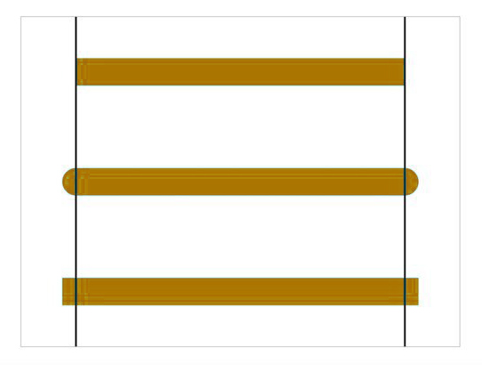

# canvas教程
canvas 是一个可以使用脚本(通常为 JavaScript )在其中绘制图形的 HTML 元素。
Internet Explorer 9+ 支持。

## 基本结构
``` html
<!-- index.html -->
<canvas id="mycanvas" width="200" height="300">
  您的浏览器不支持canvas
</canvas>
```
``` js
// index.js
var mycanvas = document.getElementById("mycanvas");
var cxt = mycanvas.getContext("2d");

// 检测当前浏览器是否支持
var mycanvas = document.getElementById('mycanvas');
if (mycanvas.getContext) {
  var ctx = mycanvas.getContext('2d'); // 支持
} else { 
  //不支持 
}
```

### getContext('2d')
这个方法是用来获得 2d 渲染上下文和它的绘画功能。

canvas 是一个二维网格，以左上角坐标为(0,0)。

canvas 的默认大小为 300像素 × 150像素（宽 × 高），也可以设置 width 和 height 来自定义尺寸，默认画布是透明的，是不可见的。

### 尺寸
canvas 元素有两套尺寸：一个是元素本身的大小(通过 CSS 设置)，另一个是元素绘图表面的大小(通过 canvas 自身的 width 和 height 属性设置)。

通过 CSS 修改 width 和 height，只是改变了元素本身大小，对元素绘图表面的大小并无影响;而通过修改属性 width 和 height，则会同时改变元素本身大小和绘图表面大小。

# 基础绘制
## 画笔设置
### 线宽
设置画笔(线条)的粗细，单位为像素。

``` js
ctx.lineWidth = 5;
```

### 线条样式
设置画笔(线条)的颜色和样式。

``` js
ctx.strokeStyle = "#AA394C";
```

### 填充样式
设置填充颜色和样式。

``` js
ctx.fillStyle = "yellow";
```

### lineCap 属性
定义线条的端点样式：

* butt：默认值，端点是垂直于线段边缘的平直边缘。
* round：端点是在线段边缘处以线宽为直径的半圆。
* square：端点是在选段边缘处以线宽为长、以一半线宽为宽的矩形



### lineJoin 属性
定义两条线相交产生的拐角，也称为连接。

* miter：默认值，在连接处边缘延长相接。miterLimit 是角长和线宽所允许的最大比例(默认是 10)。
* bevel：连接处是一个对角线斜角。
* round：连接处是一个圆。


### 线性渐变
``` js
// 第一步：添加渐变线
var linear = ctx.createLinearGradient(xstart,ystart,xend,yend);

// 第二步：为渐变添加颜色断点
linear.addColorStop(stop,color);
// stop 值介于 0 ~ 1 之间，代表占整个渐变色长度的比例。

// 第三步：应用渐变
ctx.fillStyle = linear;
ctx.strokeStyle = linear;
```

案例：

``` js
//添加渐变线
var linear = ctx.createLinearGradient(100,300,700,300);

//添加颜色断点
linear.addColorStop(0,"olive");
linear.addColorStop(0.25,"maroon");
linear.addColorStop(0.5,"aqua");
linear.addColorStop(0.75,"fuchsia");
linear.addColorStop(0.25,"teal");

//应用渐变
ctx.fillStyle = grd;
ctx.strokeStyle = grd;

ctx.strokeRect(200,50,300,50);
```

### 径向渐变
径向渐变是基于两个圆定义的。

``` js
// 第一步：添加渐变圆：
var radial = ctx.createRadialGradient(x0,y0,r0,x1,y1,r1);

// 第二步：为渐变线添加颜色断点
radial.addColorStop(stop,color);

// 第三步：应用渐变：
ctx.fillStyle = radial;
ctx.strokeStyle = radial;
```

案例：

``` js
//添加渐变线
var radial = context.createRadialGradient(400,300,100,400,300,200);

//添加颜色断点
radial.addColorStop(0,"olive");
radial.addColorStop(0.25,"maroon");
radial.addColorStop(0.5,"aqua");
radial.addColorStop(0.75,"fuchsia");
radial.addColorStop(1,"teal");

//应用渐变
ctx.fillStyle = radial;

ctx.fillRect(100,100,600,400);
```

## 绘画方式
ctx.fill() ：填充

ctx.stroke() ：描边

Canvas 是基于路径的绘制，只有调用了 stroke() 和 fill() 才确定绘制。

## 路径
### moveTo()
ctx.moveTo(100,100) 是 移动画笔至(100,100)这个点（单位是px）。这里是以 canvas 画布的左上角为笛卡尔坐标系的原点，且 y 轴的正方向向下，x 轴的正方向向右。

### lineTo()
ctx.lineTo(600,600) 是从 上一点 绘制到(600,600)这里。

``` js
// 画一条线
ctx.moveTo(100,100);
ctx.lineTo(600,600);
ctx.lineWidth = 5;
ctx.strokeStyle = "#AA394C";
ctx.stroke();

// 画折线
ctx.moveTo(100,100);
ctx.lineTo(300,300);
ctx.lineTo(100,500);
ctx.lineWidth = 5;
ctx.strokeStyle = "#AA394C";
ctx.stroke();
```

### beginPath()
路径开始绘画，为了绘制不同样式的线条，可以在每次绘制之前加上 beginPath()，代表下次绘制的起始之处。

``` js
// 多条不同样式的线条
ctx.beginPath();
ctx.moveTo(100,100);
ctx.lineTo(300,300);
ctx.lineTo(100,500);
ctx.lineWidth = 5;
ctx.strokeStyle = "red";
ctx.stroke();

ctx.beginPath();
ctx.moveTo(300,100);
ctx.lineTo(500,300);
ctx.lineTo(300,500);
ctx.lineWidth = 5;
ctx.strokeStyle = "blue";
ctx.stroke();

ctx.beginPath();
ctx.moveTo(500,100);
ctx.lineTo(700,300);
ctx.lineTo(500,500);
ctx.lineWidth = 5;
ctx.strokeStyle = "black";
ctx.stroke();
```

### closePath()
结束路径绘画。与 beginPath() 对应。

> 注意：如果绘画的路径没有闭合，调用该方法后，会导致路径闭合，形成一个封闭的空间，所以绘画路径时，一般调用 beginPath()，而不一定调用 closePath()，除非需要封闭的图形。

> 同时可以使用 closePath() 来解决线条接头处的缺口。

## 矩形
Canvas 提供了一些封装好的绘制图形的方法。

### 1、绘制矩形路径：
``` js
rect(x, y, width, height)
```

案例：

``` js
var myCanvas = document.getElementById('myCanvas');
var ctx = myCanvas.getContext('2d');
ctx.rect(10, 10, 80, 80); // 只是一个路径
ctx.fill(); // 填充
ctx.stroke(); //描边
```

### 2、绘制一个填充的矩形
可以直接绘制一个带有填充颜色的矩形。

``` js
fillRect( x ,y ,width, height)
```

* x：矩形起始点的 x 轴坐标。
* y：矩形起始点的 y 轴坐标。
* width：矩形的宽度。
* height：矩形的高度。

案例：

``` js
var myCanvas = document.getElementById('myCanvas');
var ctx = myCanvas.getContext('2d');
ctx.fillRect(10, 10, 80, 80);
```
### 3、绘制一个矩形的边框
``` js
strokeRect( x ,y ,width, height)
```

案例：

``` js
var canvas = document.getElementById('canvas');
var ctx = canvas.getContext('2d');
ctx.strokeRect(10, 10, 80, 80);
```

### 4、清除指定矩形区域
``` js
clearRect( x ,y ,width, height)
```

案例：

``` js
var canvas = document.getElementById('canvas');
var ctx = canvas.getContext('2d');
ctx.fillRect(10, 10, 80, 80);

ctx.clearRect(20, 20, 30, 30);
ctx.clearRect(60, 60, 10, 10);
```

## 绘制文字

``` js
ctx.fillText(text, x, y, maxWidth);
```

* `text`表示需要绘制的文本内容；
* `x, y`为文本绘制的坐标位置；
* `maxWidth`是可选参数，是这段文本所占据的最大宽度，因为 canvas 绘制的文字不会自动换行，这里的`maxWidth`并不是表示文本超过这个宽度会自动换行，而是文本会自动收缩变窄，就像被门挤了一样，保证一行显示同时宽度不超过这个限制。


## 绘制图片

``` js
ctx.drawImage(img, dx, dy);
ctx.drawImage(img, dx, dy, dWidth, dHeight);
ctx.drawImage(img, sx, sy, sWidth, sHeight, dx, dy, dWidth, dHeight);
```

* img：可以是图片、视频、画布；
* dx：在画布上放置图像的 x 坐标位置。
* dy：在画布上放置图像的 y 坐标位置。
* dWidth：可选，要使用的图像的宽度。（伸展或缩小图像）
* dHeight：可选，要使用的图像的高度。（伸展或缩小图像）
* sx：可选，开始剪切的 x 坐标位置。
* sy：可选，开始剪切的 y 坐标位置。
* sWidth：可选，被剪切图像的宽度。
* sHeight：可选，被剪切图像的高度。
* 

## 像素点信息获取

``` js
ctx.getImageData(sx, sy, sw, sh);
```

* `sx, sy`表示你想获取的像素信息区域的左上角坐标，
* `sw, sh`表示你想获取的像素信息区域的宽度和高度


理解：

* 返回一个 ImageData 对象，获得画布上指定矩形的像素数据，属性有 data 和 width，height。

* `ImageData.data` 是个一维数组，类型为`Uint8ClampedArray`，包含以 RGBA 顺序的数据，数据使用 0 至 255（包含）的整数表示，其中 A - alpha 通道 (0-255; 0 是透明的，255 是完全可见的)。

  ``` js
  // 如 rgba(0,0,0,1)以及rgba(255,255,255,1)，其中RGB颜色和canvas中的ImageData范围一致，是0~255，但这个与透明度相关的A需要转换下，0->0，1->255
  // 所以，如果我们使用getImageData()获取这两个像素点信息，则imageData.data数组如下所示：
  [0,0,0,255,255,255,255,255]
  ```

* 每个数字只代表一个，比如说第一个数字代表第一个像素的R值，第二个数字代表第一个像素的G值，第三第四个分别代表第一个像素的B值和Alpha值，第五个数字就代表第二个像素的R值。

* 图像是二维的，是由 height 决定行数，width 决定列像素的行列式。


> 注意：源于 canvas无法对**没有权限的跨域图片**进行操作，如出现跨域，对图片的操作(如getImageData、canvas.toDataURL)会报错。要解决这个问题，就需要图片所在的服务器允许跨域访问(设置消息头Access-Control-Allow-Origin="*"或者你的网站域名)，且本地也需要开启跨域权限(img.crossOrigin = "anonymous")。

## 贝塞尔曲线


## Canvas动画

绘制图像动画效果，需要绘制出每一帧的图像，然后在一个极短的时间内从一帧过渡到下一帧，形成动画效果。

### 制作canvas动画的基本步骤
1. 清空canvas：除了背景图像之外，需要清空之前绘制的所有图形；

2. 保存canvas的状态：如果在这一步中你使用了不同的绘图状态（例如描边大小和填充色等），并且你想在绘制每一帧时使用相同的原始状态，你需要保存这些原始状态；

3. 绘制动画图形：这一步中你需要绘制那些动画的图形元素；

4. 恢复canvas状态：如果你之前保存过canvas的状态，在这一步中将它们恢复。

### 控制canvas动画
需要一种方法来在指定时间内执行我们的绘制图形函数。有两种方式可以控制动画的执行。

方法一是使用下面的三个window对象上的方法：

* setInterval(function, delay)：在每delay毫秒时间内反复执行function指定的函数；

* setTimeout(function, delay)：在delay毫秒内执行function指定的函数；

* requestAnimationFrame(callback)：通知浏览器你需要执行一个动画，并请求浏览器调用指定的函数来在下一次重绘前更新动画。

方法二是使用事件监听。例如你需要做一个小游戏，你可以监听键盘和鼠标的事件，然后在捕获相应的事件时使用setTimeout()方法来制作动画效果。

为了获得更好的动画性能，我们通常使用requestAnimationFrame()方法。当浏览器装备好绘制下一帧动画时，我们可以将绘制函数作为参数传入这个方法中。

一个简单的例子：

``` js
function animate() {
 
    reqAnimFrame = window.mozRequestAnimationFrame    ||
                   window.webkitRequestAnimationFrame ||
                   window.msRequestAnimationFrame     ||
                   window.oRequestAnimationFrame
                   ;
 
    reqAnimFrame(animate);
 
    draw();
}
```
* `animate()` 函数首先会获取 `requestAnimationFrame()` 函数的一个引用。注意在不同的浏览器中兼容写法；

* 然后 `reqAnimFrame()` 方法被调用，并将 `animate()` 函数作为参数传入。当浏览器准备好绘制下一帧动画时，`animate()` 函数就会被调用；

* 最后，`animate()` 函数会调用 `draw()` 方法。`draw()` 方法就是前面提到的绘制一个动画帧的4个步骤：清空canvas，保存状态，绘制图形，恢复状态；

* 还有一件需要注意的事情是 `animate()` 函数必须被调用一次来启动动画，否则 `requestAnimationFrame()` 函数将永远不会被调用，动画也不会被正常执行。

完整代码：

``` js
var x =  0;
var y = 15;
var speed = 5;
function animate() {
    reqAnimFrame = window.mozRequestAnimationFrame ||
                window.webkitRequestAnimationFrame ||
                window.msRequestAnimationFrame ||
                window.oRequestAnimationFrame
                ;
    reqAnimFrame(animate);
    x += speed;
    if(x <= 0 || x >= 475){
        speed = -speed;
    }
    draw();
}
function draw() {
    var canvas  = document.getElementById("canvas");
    var context = canvas.getContext("2d");
    context.clearRect(0, 0, 500, 170);
    context.fillStyle = "#ff00ff";
    context.fillRect(x, y, 25, 25);
}
animate();
```

## 粒子动画
