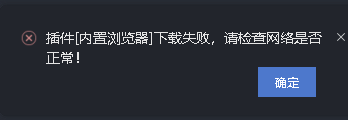

`uni-app` 是一个使用 Vue.js 开发所有前端应用的框架，开发者编写一套代码，可发布到 iOS、Android、H5、以及各种小程序（微信/支付宝/百度/头条/QQ/钉钉）等多个平台。

### 开发规范

- 页面文件遵循 Vue 单文件组件 (SFC) 规范
- 组件标签靠近小程序规范，详见uni-app 组件规范
- 接口能力（JS API）靠近微信小程序规范，但需将前缀 `wx` 替换为 `uni`，详见uni-app接口规范
- 数据绑定及事件处理同 `Vue.js` 规范，同时补充了App及页面的生命周期
- 为兼容多端运行，建议使用flex布局进行开发

### 目录结构

``` bash
┌─components            uni-app组件目录
│  └─comp-a.vue         可复用的a组件
├─hybrid                存放本地网页的目录
├─platforms             存放各平台专用页面的目录
├─pages                 业务页面文件存放的目录
│  ├─index
│  │  └─index.vue       index页面
│  └─list
│     └─list.vue        list页面
├─static                存放应用引用静态资源（如图片、视频等）的目录，注意：静态资源只能存放于此
├─wxcomponents          存放微信小程序组件的目录（App、微信小程序支持）
└──custom               微信小程序自定义组件
│  ├─index.js
│  ├─index.wxml
│  ├─index.json
│  └─index.wxss
├─main.js               Vue初始化入口文件
├─App.vue               应用配置，用来配置App全局样式以及监听 应用生命周期
├─manifest.json         配置应用名称、appid、logo、版本等打包信息
└─pages.json            配置页面路由、导航条、选项卡等页面类信息
```

> 注意：

- static 目录下的 js 文件不会被编译，如果里面有 es6 的代码，不经过转换直接运行，在手机设备上会报错。
- css、less/scss 等资源同样不要放在 static 目录下，建议这些公用的资源放在 common 目录下。

### 生命周期

uni-app 完整支持 `Vue` 实例的生命周期，并新增两类：应用生命周期函数、页面生命周期函数。

应用生命周期函数只能定义在 `App.vue` 中，具有以下的几个周期函数：

|      函数名       |                    说明                    |
| :---------------: | :----------------------------------------: |
|     onLaunch      |       `uni-app` 初始化完成时触发一次       |
|      onShow       | `uni-app` 启动，或从后台进入前台显示时触发 |
|      onHide       |       `uni-app` 从前台进入后台时触发       |
|      onError      |            `uni-app` 报错时触发            |
| onUniNViewMessage |      对 `nvue` 页面发送的数据进行监听      |

页面生命周期函数可以定义在各个页面中：

| 函数名                              | 说明                                                         | 平台差异说明                                        | 最低版本 |
| ----------------------------------- | ------------------------------------------------------------ | --------------------------------------------------- | -------- |
| onLoad                              | 监听页面加载，其参数为上个页面传递的数据，参数类型为Object（用于页面传参） |                                                     |          |
| onShow                              | 监听页面显示。页面每次出现在屏幕上都触发，包括从下级页面点返回露出当前页面 |                                                     |          |
| onReady                             | 监听页面初次渲染完成。注意如果渲染速度快，会在页面进入动画完成前触发 |                                                     |          |
| onHide                              | 监听页面隐藏                                                 |                                                     |          |
| onUnload                            | 监听页面卸载                                                 |                                                     |          |
| onResize                            | 监听窗口尺寸变化                                             | 5+App、微信小程序                                   |          |
| onPullDownRefresh                   | 监听用户下拉动作，一般用于下拉刷新                           |                                                     |          |
| onReachBottom                       | 页面上拉触底事件的处理函数                                   |                                                     |          |
| onTabItemTap                        | 点击 tab 时触发，参数为Object                                | 微信小程序、百度小程序、H5、5+App（自定义组件模式） |          |
| onShareAppMessage                   | 用户点击右上角分享                                           | 微信小程序、百度小程序、头条小程序、支付宝小程序    |          |
| onPageScroll                        | 监听页面滚动，参数为Object                                   |                                                     |          |
| onNavigationBarButtonTap            | 监听原生标题栏按钮点击事件，参数为Object                     | 5+ App、H5                                          |          |
| onBackPress                         | 监听页面返回，返回 event = {from:backbutton、 navigateBack} ，backbutton 表示来源是左上角返回按钮或 android 返回键；navigateBack表示来源是 uni.navigateBack | 5+App、H5                                           |          |
| onNavigationBarSearchInputChanged   | 监听原生标题栏搜索输入框输入内容变化事件                     | 5+App、H5                                           | 1.6.0    |
| onNavigationBarSearchInputConfirmed | 监听原生标题栏搜索输入框搜索事件，用户点击软键盘上的“搜索”按钮时触发。 | 5+App、H5                                           | 1.6.0    |
| onNavigationBarSearchInputClicked   | 监听原生标题栏搜索输入框点击事件                             | 5+App、H5                                           | 1.6.0    |

> 注：组件内（页面除外）不支持 `onLoad`、`onShow` 等页面生命周期

`onPageScroll` 参数说明：

| 属性      | 类型   | 说明                                 |
| --------- | ------ | ------------------------------------ |
| scrollTop | Number | 页面在垂直方向已滚动的距离（单位px） |

`onTabItemTap` 参数说明：

| 属性     | 类型   | 说明                         |
| -------- | ------ | ---------------------------- |
| index    | String | 被点击tabItem的序号，从0开始 |
| pagePath | String | 被点击tabItem的页面路径      |
| text     | String | 被点击tabItem的按钮文字      |

`onNavigationBarButtonTap` 参数说明：

| 属性  | 类型   | 说明                     |
| ----- | ------ | ------------------------ |
| index | Number | 原生标题栏按钮数组的下标 |

`onBackPress` 回调参数对象说明：

| 属性 | 类型   | 说明                                                         |
| ---- | ------ | ------------------------------------------------------------ |
| from | String | 触发返回行为的来源：'backbutton'——左上角导航栏按钮及安卓返回键；'navigateBack'——uni.navigateBack() 方法。 |

### 语法规范

* `uni-app` 完整支持 `Vue` 模板语法；
* `data` 必须声明为返回一个初始数据对象的函数；
* 原生组件上的事件绑定，需要以 `vue` 的事件绑定语法来绑定；

### 样式处理

* 支持的通用 css 单位包括 px、rpx；

* 使用`@import`语句可以导入外联样式表；

* 静态的样式统一写到 class 中，style 接收动态的样式；

* 定义在 App.vue 中的样式为全局样式，作用于每一个页面。在 pages 目录下 的 vue 文件中定义的样式为局部样式，只作用在对应的页面；

* uni-app 提供内置 CSS 变量；

  * `var(--status-bar-height)` -- 系统状态栏高度；

  * `var(--window-top)`  -- 内容区域距离顶部的距离；

  * `var(--window-bottom)` -- 内容区域距离底部的距离;

    ``` css
    .status_bar {
      height: var(--status-bar-height);
       width: 100%;
    }
    ```

* `uni-app` 支持使用在 css 里设置背景图片，支持 base64、网络路径图片、本地图片需小于 40kb（使用以 `~@` 开头的绝对路径）;

* `uni-app` 支持使用字体图标，支持 base64、支持以 https 开头的网络图标、本地图标需小于 40kb（使用以 `~@` 开头的绝对路径）;

### 全局变量的几种实现方式

#### 方式1、公用模块

定义一个专用的模块，用来组织和管理这些全局的变量，在需要的页面引入。

``` js
// 新建 common/helper.js 文件，用于定义公用的方法
const websiteUrl = 'https://faychou.cn';  
const now = Date.now || function () {  
  return new Date().getTime();  
};  
const isArray = Array.isArray || function (obj) {  
  return obj instanceof Array;  
};  

export default {  
  websiteUrl,  
  now,  
  isArray  
}
```

然后在需要的文件中引用公共模块：

``` js
// pages/index/index.vue 
import helper from '../../common/helper.js';  
  export default {  
    data() {  
      return {};  
    },  
    onLoad(){  
      console.log('now:' + helper.now());  
    },  
    methods: {  
    }  
  }  
```

#### 方式2、挂载 Vue.prototype

将一些使用频率较高的常量或者方法，直接扩展到 Vue.prototype 上，每个 Vue 对象都会“继承”下来。

``` js
// main.js
Vue.prototype.websiteUrl = 'https://faychou.cn';  
Vue.prototype.now = Date.now || function () {  
  return new Date().getTime();  
};  
Vue.prototype.isArray = Array.isArray || function (obj) {  
  return obj instanceof Array;  
};
```

使用：

``` js
// pages/index/index.vue 
export default {  
  data() {  
    return {};  
  },  
  onLoad(){  
    console.log('now:' + this.now());  
  },  
  methods: {  
  }  
} 
```

#### 方式3、globalData

在 App.vue 可以定义 globalData ，也可以使用 API 读写这个值。

``` js
// App.vue 中定义
export default {  
  globalData: {  
    text: 'text'  
  },  
  onLaunch: function() {  
    console.log('App Launch')  
  },  
  onShow: function() {  
    console.log('App Show')  
  },  
  onHide: function() {  
    console.log('App Hide')  
  }  
} 
```

使用：

``` js
// 其他 js 文件中使用

// 取值：
console.log(getApp().globalData.text) // 'text'

// 赋值：
getApp().globalData.text = 'test'
```

#### 方式4、Vuex

`uni-app` 内置了 vuex：

``` js
// 新建 store/index.js
import Vue from 'vue'
import Vuex from 'vuex'

const store = new Vuex.Store({  
  state: {  
    login: false,  
    token: '',  
    avatarUrl: '',  
    userName: ''  
  },  
  mutations: {  
    login(state, provider) {
      state.login = true;  
      state.token = provider.token;  
      state.userName = provider.userName;  
      state.avatarUrl = provider.avatarUrl;  
    },  
    logout(state) {  
      state.login = false;  
      state.token = '';  
      state.userName = '';  
      state.avatarUrl = '';  
    }  
  }  
})

export default store
```

然后在 `main.js` 中挂载：

``` js
import store from './store'  
Vue.prototype.$store = store

const app = new Vue({
  store,...
})
```

使用：

``` js
// pages/index/index.vue
import { mapState, mapMutations } from 'vuex';  

export default {  
  computed: {  
    ...mapState(['avatarUrl', 'login', 'userName'])  
  },  
  methods: {  
    ...mapMutations(['logout'])  
  }  
}  
```


### 关于使用 Hbuilder X 下载插件时报错

使用最新的 Hbuilder X 下载插件时，经常会出现这个错误：




`HbuilderX.exe`->`【右键】`->`以管理员身份运行` 。