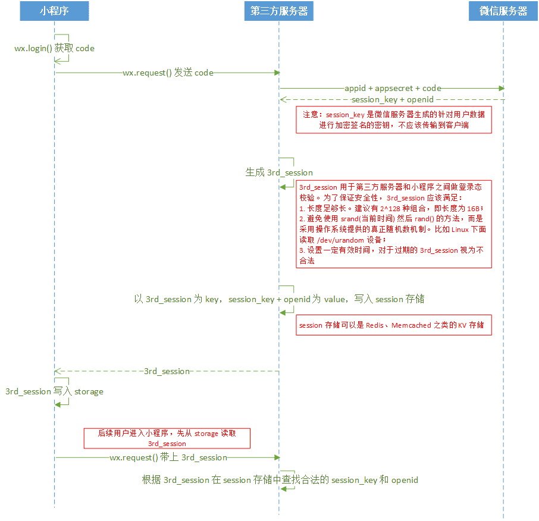

# 登录态维护
在微信小程序中，有以下三类登录方式：

* 自有的账号注册和登录
* 使用其他第三方平台账号登录
* 使用微信账号登录（即直接使用当前已登录的微信账号来作为小程序的用户进行登录）

第一和第二种方式是目前 Web 应用中最常见的两种方式，在微信小程序中同样可以使用，但是需要值的注意的是，小程序中没有 Cookie 的机制，所以在使用这2种方式前，请确认你们或第三方的 API 是否需要依赖 Cookie；还有小程序中也不支持 HTML 页面，那些需要使用页面重定向来进行登录的第三方 API 就需要改造，或不能用了。

## 微信账号登录
登录流程：



### 第一步、在小程序端获取当前登录微信用户的登录凭证(code)并发送到服务器
使用 `wx.login()` 获取登录凭证：

``` js
App({
  onLaunch: function() {
    wx.login({
      success: function(res) {
        var code = res.code;
        if (code) {
          console.log('获取用户登录凭证：' + code);

          // --------- 将登录凭证发往你自己的服务端 ------------------
          wx.request({
            url: 'https://www.faychou.cn/wx/onlogin',
            method: "post",
            data: { code: code }
          })
          // ------------------------------------

        } else {
          console.log('获取用户登录态失败：' + res.errMsg);
        }
      }
    });
  }
})
```

### 第二步、在自家服务器端使用该凭证向微信服务器换取该微信用户的唯一标识(openid)和会话密钥(session_key)
在自家的后端服务器去调用微信接口换取 openid 和 session_key：

``` js
router.post('/wx/onlogin', function (req, res, next) {
  let code = req.query.code

  request.get({
    uri: 'https://api.weixin.qq.com/sns/jscode2session',
    json: true,
    qs: {
      grant_type: 'authorization_code',
      appid: '你小程序的APPID',
      secret: '你小程序的SECRET',
      js_code: code
    }
  }, (err, response, data) => {
    if (response.statusCode === 200) {
      console.log("[openid]", data.openid)
      console.log("[session_key]", data.session_key)

      //TODO: 生成一个唯一字符串sessionid作为键，将openid和session_key作为值，存入redis，超时时间设置为2小时
      //伪代码: redisStore.set(sessionid, openid + session_key, 7200)

      res.json({ sessionid: sessionid })
    } else {
      console.log("[error]", err)
      res.json(err)
    }
  })
})
```

但是为了安全，不要直接使用这些信息作为你小程序的用户标识和 session 标识回传到小程序客户端中去，我们应该在服务器端做一层自己的 session，将这个微信账号登录态生成一个 session_id 并维护在我们自己的 session 机制中，然后把这个 session_id 派发到小程序客户端作为 session 标识来使用。

关于如何在服务器端做这个 session 机制，一般采用键值对存储工具来做，比如 redis。我们为每个 session 生成一个唯一的字符串作为键，然后可以将 session_key 和 openid 作为值，存入 redis 中，为了安全，存入的时候还应设置一个超时的时间。

### 第三步、在小程序端保存 session_id
将 session_id 存放在 storage 中，在之后，调用那些需要登录后才有权限的访问的后台服务时，你可以将保存在 storage 中的 session_id 取出并携带在请求中（可以放在 header 中携带，也可以放在 querystring 中，或是放在 body 中，根据你自己的需要来使用），传递到后台服务，后台代码中获取到该 session_id 后，从 redis 中查找是否有该 session_id 存在，存在的话，即确认该 session 是有效的，继续后续的代码执行，否则进行错误处理。

``` js
router.get('/wx/products/list', function (req, res, next) {
  let sessionid = req.header("sessionid")
  let sessionVal = redisStore.get(sessionid)

  if (sessionVal) {
    // 执行其他业务代码
  } else {
    // 执行错误处理
  }
})
```

